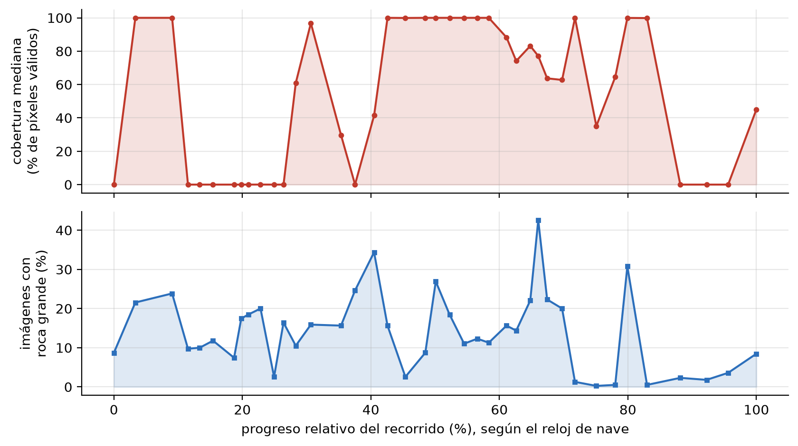
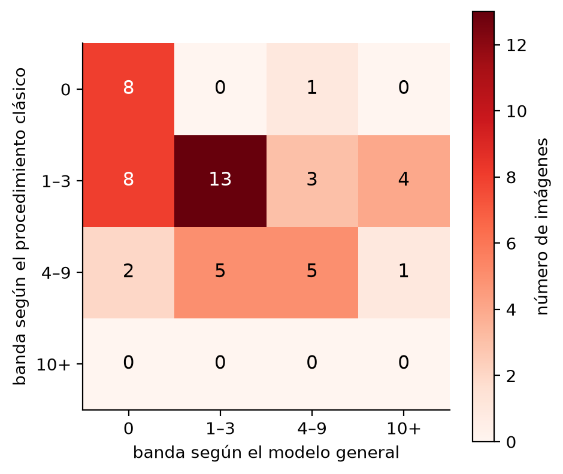
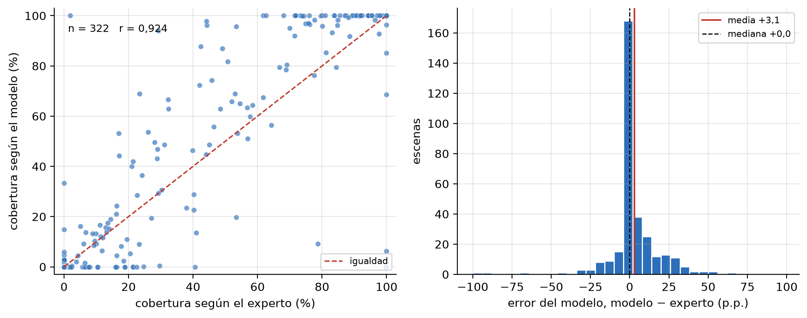
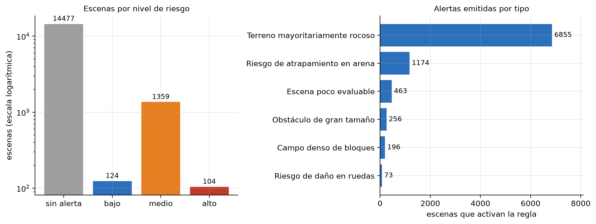
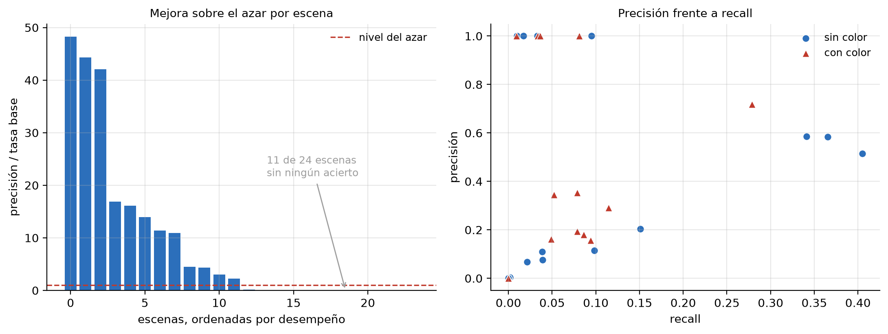

# Counting visible rocks in Martian imagery (AI4Mars)

**🌐 Language:** [Español](README.md) · **English**

Undergraduate thesis that turns the segmentation masks of the **AI4Mars** dataset
(NASA/JPL) into **quantitative terrain indicators**, image by image, using classical image
processing and without training any model.

> **Author:** Juan Pablo Delgado Castro
> **Programme:** Data Science · Department of Mathematics · Universidad Externado de Colombia
> **Status:** procedure run over 16,064 scenes · thesis document written (87 pages)

---

## The idea in one paragraph

AI4Mars contains tens of thousands of Mars images with **terrain maps painted pixel by
pixel** by volunteers. That material has been used almost exclusively for one purpose:
*training neural networks*, where the mask acts as the ground truth a model is measured
against.

This work starts from a different observation. That mask is not merely the answer to a
learning problem: it is itself a **quantitative map of the terrain**. If a pixel states
"there is rock here", then counting pixels and grouping the ones that touch makes it
possible to measure how much rock there is and how it is organised — without training
anything, with every threshold in plain sight, on a laptop.

## Research question

> How can visible rock coverage and the approximate number of individual rocks per image be
> quantified from the labelled masks of AI4Mars, through an image-processing pipeline with
> explicit parameters and reproducible results?

The question has two halves of very different difficulty. Measuring coverage is counting
pixels with a well-chosen denominator. Counting rocks requires solving an instance
segmentation problem over a mask **that does not distinguish instances**: when two rocks
touch, they are recorded as a single connected region.

The work addresses both and reports in equal detail where each one works and where it does
not.

---

## 1. The dataset

| | |
|---|---|
| **Source** | [AI4Mars v0.6](https://doi.org/10.5281/zenodo.15995036) (Zenodo) · imagery from the [Planetary Data System](https://pds-imaging.jpl.nasa.gov/) |
| **Study subset** | MSL NavCam (*Curiosity*), training labels |
| **Scenes analysed** | **16,064** (every scene with a mask) |
| **Resolution** | 1024 × 1024 px, greyscale; the mask has the same size |

### How the labels were produced

- **Training** (used by this work): crowdsourced annotation on Zooniverse, with a minimum of
  3 labellers and **2-of-3 agreement** per pixel. Without that agreement the pixel is left
  unlabelled.
- **Test** (used for validation): **322 masks from NASA JPL specialists**, requiring
  **100% agreement**, in three levels of strictness.

The rover body and everything beyond 30 metres are masked as *unlabelled*.

### Mask encoding

| Value | Class | Description |
|:---:|---|---|
| `0` | soil | Compact, traversable regolith |
| `1` | bedrock | Rock exposed in continuity with the substrate |
| `2` | sand | Loose deposit, entrapment risk |
| `3` | big rock | Discrete block resting on the terrain |
| `255` | NULL | Pixel with no class assigned |

> **A critical verification.** The encoding assumed in the project proposal was **wrong**
> (it posited five classes with background at value zero). It was verified three independent
> ways before computing any indicator: against the dataset's class-key file, against its
> documentation, and pixel by pixel on a sample cross-checked with the imagery. Carrying
> that error forward would have invalidated every result **silently**.

---

## 2. The procedure, step by step

### Visible rock coverage (E1)

Let `M` be the mask. Define the set of **labelled** pixels and the set of **rock** pixels:

```
V = { p : M(p) ≠ 255 }          →  pixels that received a label
R = { p : M(p) ∈ {1, 3} }       →  rock pixels (bedrock + big rock)

C = 100 · |R| / |V|
```

**Example.** An image of 100 pixels, 45 of which were labelled and 30 are rock:
`C = 100 · 30/45 = 66.7%`. Note the denominator is **what was labelled**, not the image:
over the full image it would be 30%. Both measures are reported, and that difference is the
origin of [Finding 1](#finding-1-crowdsourced-annotation-overestimates-rock).

### Counting individual rocks (E2)

Five stages over the binary *big rock* mask:

**1. Binary mask.** Of the five possible values, only class 3 is kept. Everything else
becomes background.

**2. Morphological cleaning.** An *opening* followed by a *closing*, with a 3×3 window. The
opening removes isolated specks produced by imprecision in tracing the annotation polygons;
the closing fills small holes.

**3. Euclidean distance transform.** Each rock pixel is assigned its distance to the nearest
background pixel:

```
D(p) = min ‖p − q‖   for all q ∉ B
```

Region centres receive high values and edges low ones. The result reads as a **relief map**:
each rock is a hill, and *the point where two rocks touch is a valley*, because there the
background is close on both sides.

**4. Watershed.** Seeds are placed on the peaks and the inverted relief `−D` is "flooded"
until the regions meet. The boundary settles in the valley. Seeds are selected by
**prominence** (h-maxima transform): a maximum is kept only if its height above its
surroundings exceeds a threshold.

**5. Size and shape filters.** Each region must pass two criteria: a **minimum area** of
524 px (0.05% of the image) and an **aspect ratio** no greater than 5.

### The example that explains everything

Two 3×3 "rocks" joined by a single-pixel bridge:

```
BINARY MASK B                  DISTANCE TRANSFORM D

. . . . . . . . . . .          .    .    .    .    .    .    .    .    .    .    .
. # # # . . . # # # .          .  1.0  1.0  1.0    .    .    .  1.0  1.0  1.0    .
. # # # # # # # # # .          .  1.0 [2.0] 1.4  1.0 [1.0] 1.0  1.4 [2.0] 1.0    .
. # # # . . . # # # .          .  1.0  1.0  1.0    .    .    .  1.0  1.0  1.0    .
. . . . . . . . . . .          .    .    .    .    .    .    .    .    .    .    .
```

**Connected components** return *a single region*: by that criterion there is one rock. But
`D` reveals the structure: the centres are **2.0** (the peaks) and the bridge is **1.0** (the
valley), because there the background is one pixel away above and below.

The watershed returns:

```
. . . . . . . . . . .
. 1 1 1 . . . 2 2 2 .
. 1 1 1 1 1 2 2 2 2 .
. 1 1 1 . . . 2 2 2 .
. . . . . . . . . . .
```

**Two rocks**, with the boundary exactly at the bridge — where a human observer would also
cut. Formally, the boundary sits at the local minimum of `D` between two maxima, and that
minimum is the geometric constriction of the region.

**And here lies the method's limit**, which reappears in the findings: the watershed can
*only* cut where `D` presents a valley. If the annotation is a broad, smooth polygon traced
over a field of rocks, `D` forms a **single plateau with no valleys** and the procedure
returns one region, however many rocks it contains.

### On a real scene


### Parameters and their effect

None is hard-coded inside the computation: all are passed as arguments with a documented
default.

| Parameter | Value | What happens if changed |
|---|:---:|---|
| Opening and closing | 3×3 | Larger: small rocks are lost. Smaller: specks get in |
| Distance smoothing | σ = 3.0 | Smaller: irregular contours generate false peaks |
| Seed prominence | h = 1.0 | Smaller: oversegments. Larger: merges distinct rocks |
| Minimum area | 524 px | Larger: genuine small rocks are discarded |
| Aspect ratio | 5 | Larger: horizon bands enter as if they were rocks |
| Connectivity | 8-neighbour | With 4, diagonally joined rocks would separate |

> **The main calibration.** The prominence criterion replaced local-maximum detection by
> minimum separation. Under the earlier criterion, a large slab labelled *big rock* generated
> dozens of spurious seeds —one case produced **142**— and was fragmented into non-existent
> rocks. The new criterion was verified to act **selectively**: on suspicious scenes it
> reduces the count by 32% to 44%, while on normal scenes it changes no count at all.

---

## 3. Results

### Composition of the set

Every image receives a quality flag documenting its suitability for each indicator.

| Flag | Meaning | Images | % |
|---|---|---:|---:|
| `ok` | Contains big rock; suitable for both indicators | 2,193 | 13.7 |
| `no_bigrock` | Contains rock, but no big rock to count | 8,458 | 52.7 |
| `no_rock` | Labelled, no rock | 4,950 | 30.8 |
| `mostly_null` | More than 95% unlabelled | 300 | 1.9 |
| `empty` | No labelled pixel at all | 163 | 1.0 |

### Visible rock coverage (E1) — works

Of the 16,064 scenes, **10,817 (67.3%)** contain at least one rock pixel. Over those, coverage
has a median of **96.8%** over labelled pixels and **42.0%** over the full image. The
distribution is markedly **bimodal**.


**The control that had to be run.** If the formula were the problem, *sparsely* labelled
scenes would show *high* coverage, because the denominator would be small. This was tested
explicitly:


The correlation is **r = −0.02**: essentially nil. High coverages correspond to scenes
genuinely dominated by bedrock, not to a denominator artefact.

### Rock counting (E2) — has a ceiling

Applied to the 2,193 scenes with big rock, it yields **4,204 rocks**, with a median of 1 per
image and a maximum of 20.

| Rocks per image | Images | % |
|---|---:|---:|
| 0 (discarded by the filters) | 453 | 20.7 |
| 1 | 772 | 35.2 |
| 2–3 | 613 | 28.0 |
| 4–9 | 344 | 15.7 |
| 10 or more | 11 | 0.5 |


The size–frequency distribution is **decreasing** —small rocks predominate— which agrees
qualitatively with rock-abundance studies at landing sites. The comparison is one of shape,
not magnitude: sizes are relative to the field of view, not metric.


### Terrain composition and traverse (E3)

Mean composition: **bedrock 49.8%, soil 36.4%, sand 12.5%, big rock 1.3%**.


Ordering scenes by the spacecraft clock in their identifier reveals a **clear alternation**
between frankly rocky stretches and stretches of soil or sand, with localised concentrations
of big rock reaching 40% of the images in a stretch.



### The two indicators are independent

Their correlation is **r = 0.02**. This is not a detail: it means they measure distinct
facets of the terrain and **neither substitutes for the other**. A continuous outcrop yields
maximum coverage and a null count; a field of scattered blocks, the opposite.

---

## 4. Findings

The three results the work considers its main contribution were not anticipated in the
question: they emerged from validating the procedure.

### Finding 1: crowdsourced annotation overestimates rock

The dataset includes 322 specialist masks. **The same code was run over them, with no
parameter changed.**

| Indicator | Crowdsourced | Expert |
|---|:---:|:---:|
| Median coverage | 96.8% | **46.1%** |
| Scenes at 100% coverage | 41% | **8%** |
| Soil and sand pixels | 50% | **69%** |
| Bedrock pixels | 49% | 31% |


**The mechanism.** A salience bias in the annotation task. Rock is visually prominent and
easy to delimit; soil and sand are broad, homogeneous surfaces whose delimitation is tedious.
Since agreement between labellers is required, soil and sand pixels without consensus are
left **unlabelled and drop out of the denominator**, inflating the rock fraction. The third
row of the table confirms it: experts did not find more rock, they found **more soil**.

**An important qualification.** The computation itself is *not* biased: applied to expert
masks it yields plausible values. The bias resides in the input data, and the labels of the
pixels that were painted are correct. The bias lives in the aggregation formula, not in the
content of the labels.

> **Why this reaches beyond the thesis.** The entire research line that uses AI4Mars
> evaluates its models by agreement with these masks. Documenting that they overestimate
> rock, and quantifying by how much, is relevant to those works and not only to this one.

### Finding 2: the counting ceiling is the taxonomy, not the imagery

The intuitive explanation for the count's poor performance would be that better imagery is
needed. This was ruled out with three measurements:

1. **The procedure never opens the images**: all its information comes from the mask. And the
   images are already at full resolution, with the mask at the same size: there is no
   resampling loss.
2. In **13,838 scenes (86.1%)** the mask contains *no* big-rock pixel. Of the rock labelled
   in the set, bedrock contributes **97.5%** and big rock only **2.5%** — and E2 counts only
   the latter.
3. Expert masks contain **less** big rock, not more: from 16.5% of scenes down to 1.6% as the
   agreement criterion tightens.

This figure needs no explanation: a scene full of obvious individual blocks, labelled in its
entirety as **a single bedrock region**. The count returns zero. The image is excellent; the
label is the limit.


### Finding 3: the annotation is not exhaustive

Human-count validation revealed it. In **36 of 60 scenes**, the big-rock class covers
**less than 20%** of the labelled rock, with a median of **9.1%**: the annotation marks
*some* rocks, not all.

Hence a qualification about what the indicator measures: it **does not estimate the number of
rocks in a scene**, but the number of blocks within the fraction the annotator chose to
delimit as big rock. The two quantities can differ by an order of magnitude, and even a
perfect procedure over these masks would still count only what was delimited.

---

## 5. Validation against human counting

Carried out in two rounds. In each scene the region annotated as big rock is highlighted and
the question is how many rocks can be distinguished **inside that region** — narrowing the
question is what makes the disagreement attributable. Material is presented with neutral
identifiers, in shuffled order, and the automatic result never appears.

**The 24-scene pilot round proved defective and was redone.** Its top band was open-ended at
"10 or more", so a procedure counting 84 rocks where the observer saw about ten scored as an
**exact match**: the scale favoured methods that overestimate. Three further defects were
corrected: scenes whose annotated region was imperceptible, an opaque overlay that hid the
texture needed to count, and a sampling stratified by the algorithm's own band, which
conditioned the sample on the method under evaluation.

### Result (60 scenes, six bands)

| Measure | Value |
|---|---:|
| Exact band agreement | 50% |
| Cohen's kappa | 0.13 |
| Weighted kappa | 0.11 |
| Scenes below / above the observer | **28 / 2** |

The 50% agreement is misleading: **26 of the 30 matches** fall in a single band.


**The decisive feature is the three empty columns.** In none of the 60 scenes does the
procedure return more than nine rocks, while the observer identified ten or more in twelve
and twenty-five or more in five. This is not a bias recalibrable by thresholds: it is a
**structural ceiling**.

### Why: the mechanism, seen


Above, the annotation traces each block separately: there are distinct regions with clear
constrictions and the cut works (9 rocks; the observer said 4–9). Below, a single polygon
loosely traced over a field of layered rock: the distance transform forms **one plateau** and,
however many rocks it contains, there is nowhere to cut (3 rocks; the observer said 25–49).

This result **corrects the expectation the procedure was calibrated against**. The concern was
oversegmentation, and the prominence criterion was introduced to contain it. The real bias
runs the other way.

---

## 6. Comparison with machine learning

### General model, no specific training

A foundation segmentation model (FastSAM) applied to 50 scenes, restricted to the rock
region. Agreement with the classical count is **52%** by bands, with rank correlation 0.45
and mean absolute error 2.6 rocks. It tends to subdivide a single rock according to its
internal texture and to miss low-contrast blocks.



### Model trained on the masks themselves

A **DeepLabV3** segmenter via transfer learning, distinguishing rock from non-rock by reading
the image **without a human mask**. Trained on 2,000 images, 400 for validation and 400 for
test, six epochs at 512 px, with integrated-GPU acceleration.

It reaches **mean IoU of 0.940** and its coverage correlates **0.950** with the human one.


### A hypothesis that had to be tested

That figure **cannot be read as accuracy**: the model was trained on crowdsourced masks and
evaluated against crowdsourced masks, so it measures how closely it resembles the annotation
it learnt from. And since that annotation overestimates rock, the expectation was that it had
learnt the bias along with the signal.

> **The test.** If it inherited the bias, evaluating it against the 322 expert masks should
> show systematic **overestimation** of coverage.
>
> **The result.** It does not overestimate. The median error is **+0.0 percentage points**,
> with 37% of scenes above and 30% below. *Hypothesis rejected.*

| Measure | Against crowdsourced | Against expert |
|---|:---:|:---:|
| Mean IoU | 0.940 | 0.843 |
| Coverage correlation | 0.950 | 0.927 |
| Mean absolute error | 4.3 pp | 7.5 pp |
| Median error (bias) | — | **+0.0 pp** |



**Why it did not inherit it.** This fits the bias mechanism: it operates through the
*denominator* —the unlabelled soil that drops out of the computation— and not through class
error in the pixels that are labelled. Since training excludes unlabelled pixels from the
loss, the model learnt rock appearance from correctly labelled pixels.

**Declared caveats.** It estimates **coverage, not counts**: it does not separate blocks and
does not replace E2. And it is reliable **in aggregate, not scene by scene**: 23% of scenes
exceed ten points of error and five exceed fifty.

**What it opens up.** The classical procedure needs a human mask, which does not exist when
the imagery reaches Earth. The segmenter reads the image directly. That it estimates coverage
without bias against an expert reference suggests the indicator defined and audited here
could be computed **with no human annotation in the loop**.

---

## 7. Applied extension

### Terrain alert system

The indicators are translated into six rules, each with its threshold, severity and
rationale. Thresholds were set from **percentiles of the observed distribution**, not
arbitrarily.

| Alert | Threshold | Sev. | Rationale |
|---|---|:---:|---|
| Wheel damage | big rock > 5% and solidity < 0.85 | 3 | Blocks with angular contours: the condition associated with the wear documented on *Curiosity* |
| Major obstacle | largest rock > 15% | 3 | A block dominating the scene may exceed passable height |
| Sand entrapment | sand > 70% | 3 | Loose sand compromises traction; the failure mode that immobilised *Spirit* |
| Block field | 5 or more rocks | 2 | Many blocks reduce viable trajectories |
| Rocky terrain | coverage > 80% | 1 | Informative: good traction, irregular surface |
| Poorly assessable scene | > 95% unlabelled | 1 | Flags that absence of alerts is not absence of risk |

Of the 16,064 scenes: **104 high risk**, 1,359 medium, 124 low, and 14,477 with no
operational alert.



> The alerts **inherit the limitations of the indicators** they derive from, including the
> annotation bias. They are not a traversability assessment validated against real incidents
> —no such record exists for this subset— but a prioritisation of scenes whose criterion is
> explicit and therefore auditable.

### Query application

A Python desktop application that makes the results set queryable without programming, with
four views: descriptive summary, alert distribution, an explorer showing per scene the image,
the annotation and the detected rocks, and a geological-features view. Figures are generated
from the same files that back the document.

```bash
python app.py
```

---

## 8. Exploration: vein detection (negative result)

Calcium sulfate veins are deposits precipitated by circulating water and the feature of
greatest scientific interest present in the annotations. The navigation taxonomy does not
label them, so the only route would be detecting them from the image. **This was attempted
and is not viable.**

The method applied a Meijering ridge filter over the bedrock region —it analyses Hessian
eigenvalues to enhance thin curvilinear structures and is used in angiography; a vein is
geometrically the same kind of object— plus a variant weighted by the blue/red ratio.

| Measure | Without colour | With colour |
|---|:---:|:---:|
| Mean precision | 0.261 | 0.267 |
| Mean recall | 0.067 | 0.041 |
| Lift over base rate | 9.1× | 10.2× |
| Scenes with no hit at all | 11 of 24 | 12 of 24 |



**There is signal but the detector is unusable**: nine times better than chance is not noise,
but it recovers less than 7% of vein pixels and fails entirely in nearly half the scenes.

**The colour hypothesis was refuted by our own measurement.** The blue/red ratio in the
bright areas of bedrock turned out to be barely **1.025 times** that of rock overall, with
inconsistent direction across scenes. Reddish dust coats the veins too, and the dataset's
images are compressed files with white balance applied, not calibrated radiometric products.
Add that NavCam is a navigation instrument: the veins of Gale crater were characterised with
MAHLI, ChemCam and MastCam.

Documented so the attempt is not repeated without knowing its limits.

---

## 9. Repository structure

```
├── src/                         computation modules (12)
│   ├── config.py                dataset paths and NAV encoding
│   ├── mask_utils.py            mask reading and binarisation
│   ├── coverage.py              visible rock coverage (E1)
│   ├── rock_count.py            watershed-based counting (E2)
│   ├── rock_count_hybrid.py     exploration: mask + image gradient
│   ├── features.py              composition and rock geometry
│   ├── pipeline.py              orchestration: one result row per image
│   ├── alerts.py                terrain alert system
│   ├── segmentation.py          DeepLabV3 segmenter
│   ├── sam_compare.py           comparison with a foundation model
│   └── viz.py                   mask and stage visualisation
│
├── scripts/                     execution scripts (23)
│   ├── run_pipeline.py          processes the subset → results.csv
│   ├── make_thesis_figures.py   document figures
│   ├── make_mechanism_figure.py undercounting-mechanism figure
│   ├── make_validation_kit2.py  prepares the human validation
│   ├── responder_validacion.py  interface to answer it
│   ├── eval_validation.py       agreement, simple and weighted kappa
│   ├── eval_hybrid.py           hybrid-count comparison
│   ├── eval_model_expert.py     segmenter versus expert labels
│   ├── train_segmentation.py    trains the DeepLabV3
│   ├── run_alerts.py            evaluates the alert rules
│   ├── diagnose_errors.py       panels by failure mode
│   └── explore_vein_detection.py  vein exploration
│
├── tesis/                       LaTeX document (institutional template)
├── docs/                        supporting documentation (11 files)
├── outputs/
│   ├── results.csv              24 indicators × 16,064 scenes
│   ├── figures/tesis/           document figures
│   └── validacion_manual_v2/    human-validation responses
├── app.py                       desktop application
└── environment.yml              conda environment
```

---

## 10. Reproducing

```bash
# 1. Environment
conda env create -f environment.yml
conda activate tesis-marte

# 2. Dataset (~16 GB, not versioned)
#    Download from https://doi.org/10.5281/zenodo.15995036 and point to it:
export AI4MARS_ROOT=/path/to/ai4mars-dataset-merged-0.6

# 3. Main procedure → outputs/results.csv
python scripts/run_pipeline.py

# 4. Document figures
python scripts/make_thesis_figures.py
python scripts/make_mechanism_figure.py

# 5. Human validation
python scripts/eval_validation.py --dir outputs/validacion_manual_v2

# 6. Terrain alerts
python scripts/run_alerts.py
```

Recorded versions: Python 3.13, NumPy 2.5.1, SciPy 1.18.0, scikit-image 0.26.0,
pandas 3.0.5, Pillow 12.3.0.

---

## 11. Scope and limitations

**Scope.** MSL NavCam (*Curiosity*), training labels. MER, Perseverance and MastCam are out
of scope. The project does not generate new masks, model terrain evolution over time, or use
elevation data.

**Declared limitations:**

- **Coverages are relative to the crowdsourced set**, not absolute estimates of rock
  abundance on the terrain. For comparing scenes within the same set the usefulness holds,
  because the bias acts in the same direction throughout.
- **No metric scale.** Sizes are relative to the field of view. The camera is a stereo pair,
  so the route exists, but the available subset is almost entirely monocular (16,027
  left-eye images against 37 right-eye).
- **The human validation used a single observer**, so it cannot separate disagreement
  attributable to the procedure from that inherent to the task.
- **The count does not reproduce human judgement** faithfully enough to be read as the number
  of rocks in a scene.

---

## Credits

**AI4Mars** dataset — Swan, R. M., Atha, D., Leopold, H. A., Gildner, M., Oij, S., Chiu, C.,
& Ono, M. (2021). *AI4Mars: A Dataset for Terrain-Aware Autonomous Driving on Mars.*
IEEE/CVF CVPR Workshops. Imagery: NASA/JPL-Caltech.

The masks exist thanks to the work of thousands of volunteers on the AI4Mars project at
Zooniverse. The bias this work documents is a structural effect of the annotation task's
design, **not a deficiency attributable to those who performed it**.
