# Conteo de rocas visibles en imágenes marcianas (AI4Mars)

**🌐 Idioma:** **Español** · [English](README.en.md)

Trabajo de grado que convierte las máscaras de segmentación del dataset **AI4Mars**
(NASA/JPL) en **indicadores cuantitativos de terreno**, imagen por imagen, mediante
procesamiento clásico de imagen y sin entrenar ningún modelo.

> **Autor:** Juan Pablo Delgado Castro
> **Programa:** Ciencia de Datos · Departamento de Matemáticas · Universidad Externado de Colombia
> **Estado:** procedimiento ejecutado sobre 16 064 escenas · documento de tesis revisado tras las correcciones de la dirección

---

## La idea en un párrafo

AI4Mars contiene decenas de miles de imágenes de Marte con **mapas de terreno pintados
píxel a píxel** por voluntarios. Ese material se ha usado casi siempre para lo mismo:
*entrenar redes neuronales*, donde el mapa hace de respuesta correcta contra la que se
mide un modelo.

Este trabajo parte de otra observación. Ese mapa no es solo la respuesta de un problema de
aprendizaje: es en sí mismo un **mapa cuantitativo del terreno**. Si un píxel afirma «aquí
hay roca», entonces contar píxeles y agrupar los que se tocan permite medir cuánta roca hay
y cómo está organizada — sin entrenar nada, con cada umbral a la vista y en un portátil.

## Pregunta de investigación

> ¿Qué indicadores cuantitativos de cobertura y organización de la roca pueden derivarse de
> forma reproducible de las máscaras de AI4Mars, y cuáles son sus límites de validez frente a
> diferencias en la anotación y al juicio humano?

La pregunta reúne dos propósitos. El **constructivo**: derivar indicadores con parámetros
explícitos. El **crítico**: delimitar hasta dónde informan sobre el terreno y no sobre la forma
en que se anotó. Medir cobertura es contar píxeles con un denominador bien elegido. Contar rocas
exige resolver un problema de segmentación de instancias sobre una máscara **que no distingue
instancias**: cuando dos rocas se tocan, quedan registradas como una sola región conectada.

La pregunta se precisó durante la ejecución: el anteproyecto preguntaba solo *cómo*
cuantificar; la parte de los límites de validez se incorporó a la vista de lo que reveló la
validación, y la tesis lo documenta.

### Hipótesis de trabajo

| | Hipótesis | Resultado |
|---|---|---|
| **H1** | La cobertura se deriva de forma reproducible y no está determinada por la fracción de escena etiquetada | Se sostiene, con dependencia residual débil |
| **H2** | El conteo aproxima el número de rocas que un observador distingue en la región anotada, sin sesgo en una dirección | Se rechaza (evaluación exploratoria, un observador) |
| **H3** | Los indicadores no dependen de la fuente de la anotación | No concluyente para la cobertura: efecto de la fuente pequeño, positivo en todas las variantes pero distinguible de cero por sol solo en una |
| **H4** | Cobertura y conteo aportan información distinta | Se sostiene: información distinta, **no** independencia estadística |

---

## 1. El conjunto de datos

| | |
|---|---|
| **Fuente** | [AI4Mars v0.6](https://doi.org/10.5281/zenodo.15995036) (Zenodo) · imágenes del [Planetary Data System](https://pds-imaging.jpl.nasa.gov/) |
| **Subconjunto de estudio** | MSL NavCam (*Curiosity*), etiquetas de entrenamiento |
| **Escenas analizadas** | **16 064** (todas las que tienen máscara) |
| **Resolución** | 1024 × 1024 px, escala de grises; la máscara tiene el mismo tamaño |

### Cómo se produjeron las etiquetas

- **Entrenamiento** (las que usa este trabajo): anotación colaborativa en Zooniverse, con
  mínimo 3 anotadores y **acuerdo de 2 de 3** por píxel. Sin ese acuerdo, el píxel queda
  sin etiqueta.
- **Prueba** (las que se usan para validar): **322 máscaras de especialistas de NASA JPL**,
  con **100 % de acuerdo** exigido, en tres niveles de exigencia.

Se enmascara como *sin etiqueta* el cuerpo del rover y todo lo que esté a más de 30 metros.

### Codificación de la máscara

| Valor | Clase | Descripción |
|:---:|---|---|
| `0` | soil | Regolito compacto transitable |
| `1` | bedrock | Roca expuesta en continuidad con el sustrato |
| `2` | sand | Depósito suelto, riesgo de atrapamiento |
| `3` | big rock | Bloque discreto apoyado sobre el terreno |
| `255` | NULL | Píxel sin clase asignada |

> **Verificación crítica.** La codificación asumida en el anteproyecto era **incorrecta**
> (suponía cinco clases con el fondo en el valor cero). Se verificó de tres formas
> independientes antes de calcular cualquier indicador: contra el archivo de claves del
> dataset, contra su documentación, y píxel a píxel sobre una muestra contrastada con las
> imágenes. Arrastrar ese error habría invalidado todos los resultados **en silencio**.

---

## 2. El procedimiento, paso a paso

### Cobertura de roca visible (E1)

Sea `M` la máscara. Se definen el conjunto de píxeles **etiquetados** y el de **roca**:

```
V = { p : M(p) ≠ 255 }          →  píxeles que recibieron etiqueta
R = { p : M(p) ∈ {1, 3} }       →  píxeles de roca (bedrock + big rock)

C = 100 · |R| / |V|
```

**Ejemplo.** Una imagen de 100 píxeles, de los que 45 recibieron etiqueta y 30 son roca:
`C = 100 · 30/45 = 66,7 %`. Nótese que el denominador es **lo etiquetado**, no la imagen:
sobre la imagen completa serían 30 %. Ambas medidas se reportan, y de esa diferencia surge
el [control del denominador](#cobertura-de-roca-visible-e1).

### Conteo de rocas individuales (E2)

Cinco etapas sobre la máscara binaria de *big rock*:

**1. Máscara binaria.** De los cinco valores posibles se conserva solo la clase 3. Todo lo
demás pasa a ser fondo.

**2. Limpieza morfológica.** Una *apertura* seguida de un *cierre*, con ventana 3×3. La
apertura elimina motas aisladas producto de imprecisiones al trazar los polígonos; el
cierre rellena huecos pequeños.

**3. Transformada de distancia euclidiana.** A cada píxel de roca se le asigna su distancia
al fondo más cercano:

```
D(p) = mín ‖p − q‖   para todo q ∉ B
```

Los centros de las regiones reciben valores altos y los bordes, valores bajos. El resultado
se lee como un **relieve**: cada roca es una colina, y *el punto donde dos rocas se tocan es
un valle*, porque ahí el fondo está cerca por ambos lados.

**4. División de aguas.** Se sitúan semillas en las cimas y se «inunda» el relieve invertido
`−D` hasta que las regiones se encuentran. La frontera queda en el valle. Las semillas se
eligen por **prominencia** (transformada de máximos h): solo se conserva un máximo si su
altura sobre el entorno supera un umbral.

**5. Filtros de tamaño y forma.** Cada región debe superar dos criterios: **área mínima** de
524 px (0,05 % de la imagen) y **relación de aspecto** no mayor que 5.

### El ejemplo que lo explica todo

Dos «rocas» de 3×3 unidas por un puente de un solo píxel:

```
MÁSCARA BINARIA B              TRANSFORMADA DE DISTANCIA D

. . . . . . . . . . .          .    .    .    .    .    .    .    .    .    .    .
. # # # . . . # # # .          .  1,0  1,0  1,0    .    .    .  1,0  1,0  1,0    .
. # # # # # # # # # .          .  1,0 [2,0] 1,4  1,0 [1,0] 1,0  1,4 [2,0] 1,0    .
. # # # . . . # # # .          .  1,0  1,0  1,0    .    .    .  1,0  1,0  1,0    .
. . . . . . . . . . .          .    .    .    .    .    .    .    .    .    .    .
```

Las **componentes conectadas** dan *una sola región*: para ese criterio hay una roca. Pero
`D` revela la estructura: los centros valen **2,0** (las cimas) y el puente vale **1,0** (el
valle), porque ahí el fondo está a un píxel por arriba y por abajo.

La división de aguas devuelve:

```
. . . . . . . . . . .
. 1 1 1 . . . 2 2 2 .
. 1 1 1 1 1 2 2 2 2 .
. 1 1 1 . . . 2 2 2 .
. . . . . . . . . . .
```

**Dos rocas**, con la frontera exactamente en el puente — donde un observador humano también
cortaría. Formalmente, la frontera se sitúa en el mínimo local de `D` entre dos máximos, y
ese mínimo es el estrangulamiento geométrico de la región.

**Y aquí está el límite del método**, que reaparecerá en los hallazgos: la división de aguas
*solo* puede cortar donde `D` presenta un valle. Si la anotación es un polígono amplio y liso
trazado sobre un campo de rocas, `D` forma una **única meseta sin valles** y el procedimiento
devuelve una región, por muchas rocas que contenga.

### Sobre una escena real

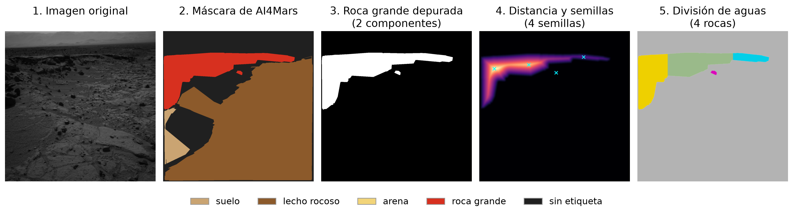

### Los parámetros y su efecto

Ninguno está fijado dentro de la lógica de cálculo: todos se pasan como argumentos con su
valor por defecto documentado.

| Parámetro | Valor | Qué ocurre si se cambia |
|---|:---:|---|
| Apertura y cierre | 3×3 | Mayor: se pierden rocas pequeñas. Menor: entran motas |
| Suavizado de la distancia | σ = 3,0 | Menor: el contorno irregular genera cimas falsas |
| Prominencia de la semilla | h = 1,0 | Menor: sobresegmenta. Mayor: fusiona rocas distintas |
| Área mínima | 524 px | Mayor: se descartan rocas reales pequeñas |
| Relación de aspecto | 5 | Mayor: entran bandas del horizonte como si fueran rocas |
| Conectividad | 8 vecinos | Con 4, dos rocas unidas en diagonal se separarían |

> **La calibración principal.** El criterio de prominencia sustituyó a la detección de
> máximos por separación mínima. Con el criterio inicial, una escena llegaba a generar **142**
> semillas, la mayoría sobre una banda alargada. `scripts/calibracion.py` reconstruye la
> calibración desde un manifiesto de seis escenas y muestra que el cambio **no fue
> selectivo**: redujo el conteo un 21 % en las escenas con solidez baja, un 41 % en las de más
> de quince rocas y también un 21 % en el resto. Rebajó el conteo de forma general, lo que es
> coherente con el subconteo que reveló la validación humana.

---

## 3. Resultados

### Poblaciones de análisis

Cada imagen recibe una bandera de calidad que documenta su aptitud para cada indicador.

| Bandera | Significado | Imágenes | % |
|---|---|---:|---:|
| `ok` | Contiene roca grande; apta para ambos indicadores | 2 193 | 13,7 |
| `no_bigrock` | Contiene roca, pero sin roca grande que contar | 8 458 | 52,7 |
| `no_rock` | Etiquetada, sin roca | 4 950 | 30,8 |
| `mostly_null` | Más del 95 % sin etiqueta | 300 | 1,9 |
| `empty` | Sin ningún píxel etiquetado | 163 | 1,0 |

- **Cobertura (E1):** las 15 901 escenas con algún píxel etiquetado (todas menos `empty`).
- **Conteo (E2):** las **2 193 escenas `ok`**. Se excluyen las 33 escenas `mostly_null` que
  tienen algún píxel de roca grande (aportarían 63 rocas): con más del 95 % de la escena sin
  etiqueta, la región es un fragmento aislado, y ahí se concentran los artefactos de anotación.

### Cobertura de roca visible (E1)

La cobertura pudo calcularse en **15 901 de las 16 064 escenas (99,0 %)**; **10 817 escenas
(67,3 % del total)** presentaron cobertura de roca mayor que cero. Entre estas últimas, la
mediana de cobertura sobre píxeles etiquetados fue **96,8 %** (42,0 % sobre la imagen
completa). La distribución es marcadamente **bimodal**.

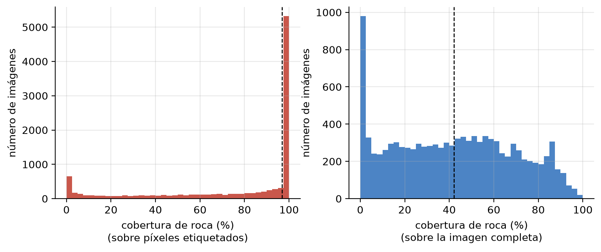

**Control del denominador.** Si las escenas poco etiquetadas conservaran sobre todo la roca,
tendrían coberturas altas por construcción.

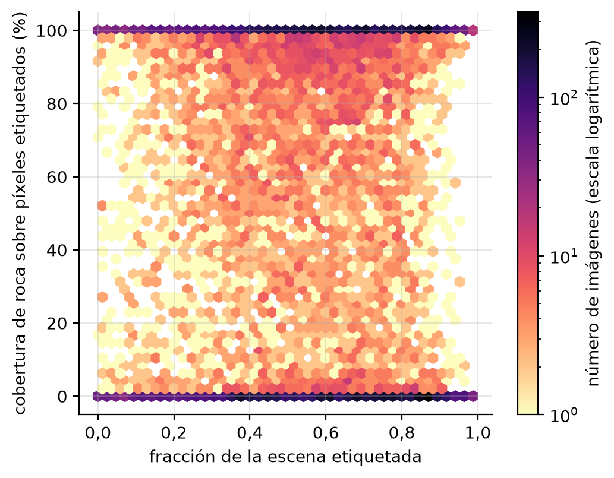

La asociación lineal entre la cobertura y la fracción etiquetada es prácticamente nula
(**r = −0,020**, IC 95 % [−0,036; −0,004]): con 15 901 escenas el intervalo por escena excluye
el cero, pero explica menos de una milésima de la varianza y deja de distinguirse de cero al
tener en cuenta que las imágenes se adquieren en secuencias (*bootstrap* por sol
[−0,047; +0,008]; desplazamiento circular, p = 0,62). La correlación de distancia (0,062) detecta
una dependencia no lineal débil. Por tramos de fracción etiquetada, la cobertura mediana **no**
sigue el patrón que produciría el artefacto (no es máxima en las escenas menos etiquetadas):

| Fracción etiquetada | Escenas | Cobertura mediana (sobre lo etiquetado) | (sobre la imagen) |
|---|---:|---:|---:|
| hasta 0,25 | 1 895 | 48,2 % | 3,4 % |
| 0,25 – 0,50 | 4 249 | 59,2 % | 22,0 % |
| 0,50 – 0,75 | 5 680 | 69,3 % | 42,8 % |
| más de 0,75 | 4 077 | 32,6 % | 26,6 % |

Las conclusiones se mantienen con la cobertura sobre la imagen completa (correlación de rangos
entre ambas versiones: 0,90).

### Conteo de rocas (E2)

Sobre las 2 193 escenas `ok`: **4 142 rocas**, mediana de 1 por imagen, máximo de 20.

| Rocas por imagen | Imágenes | % |
|---|---:|---:|
| 0 (descartadas por los filtros) | 453 | 20,7 |
| 1 | 772 | 35,2 |
| 2–3 | 613 | 28,0 |
| 4–9 | 344 | 15,7 |
| 10 o más | 11 | 0,5 |

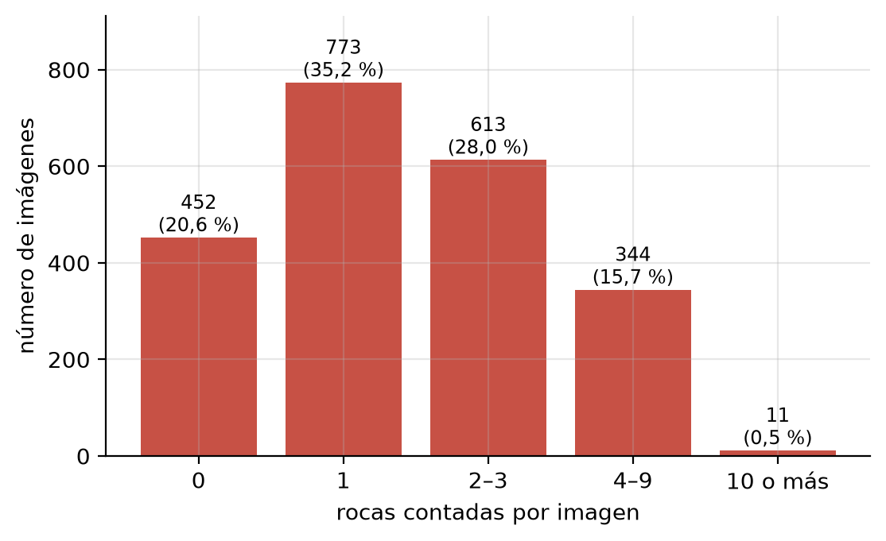

Distribución tamaño–frecuencia **decreciente** (1 806 pequeñas, 1 317 medianas, 1 019
grandes), coherente en forma —no en magnitud: los tamaños son relativos al campo de visión—
con los estudios de abundancia de rocas.

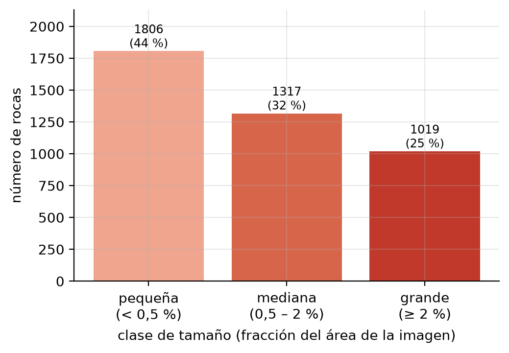

### Relación entre cobertura y conteo (H4)

Pearson próximo a cero solo excluye la asociación *lineal*; no demuestra independencia. Por eso
se midió con estadísticos progresivamente más generales (2 193 escenas):

| Medida | Detecta | Valor | p |
|---|---|---:|---:|
| Pearson r | lineal | +0,022 [−0,015; +0,059] | 0,286 |
| Spearman ρ | monótona | +0,020 [−0,019; +0,060] | 0,351 |
| Correlación de distancia | cualquiera | 0,074 | 0,002 |
| Información mutua | cualquiera | 0,123 bits (nula 0,023) | 0,005 |

**Asociación lineal prácticamente nula, pero no independencia**: hay una dependencia débil con
forma de **U invertida** —pocas rocas cuando la cobertura es muy baja (en parte por
construcción, porque la roca grande está en el numerador de la cobertura), máximo entre el 10 %
y el 50 %, y poca roca grande que contar en las escenas de cobertura total, cuya roca está
etiquetada casi toda como lecho rocoso—. Los tramos de cobertura explican el **5,6 %** de la
varianza del conteo. La dependencia resiste el control de la estructura secuencial
(desplazamiento circular: correlación de distancia p = 0,026). Los dos indicadores aportan
información distinta, aunque la relación entre ambos no es nula.

### Composición del terreno y secuencia de adquisición (E3)

Composición media: **lecho rocoso 49,8 %, suelo 36,4 %, arena 12,5 %, roca grande 1,3 %**.

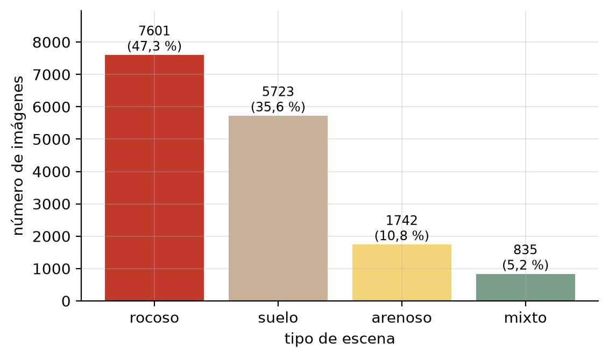

El orden temporal sale del **reloj de nave** (columna `sclk`), extraído del identificador de
cada imagen. Ordenadas así, las escenas alternan entre segmentos rocosos y de suelo o arena.
Es una variación **en la secuencia de adquisición, no en el espacio**: el rover puede tomar
muchas imágenes desde un mismo lugar, y el conjunto no incluye la posición de cada toma.

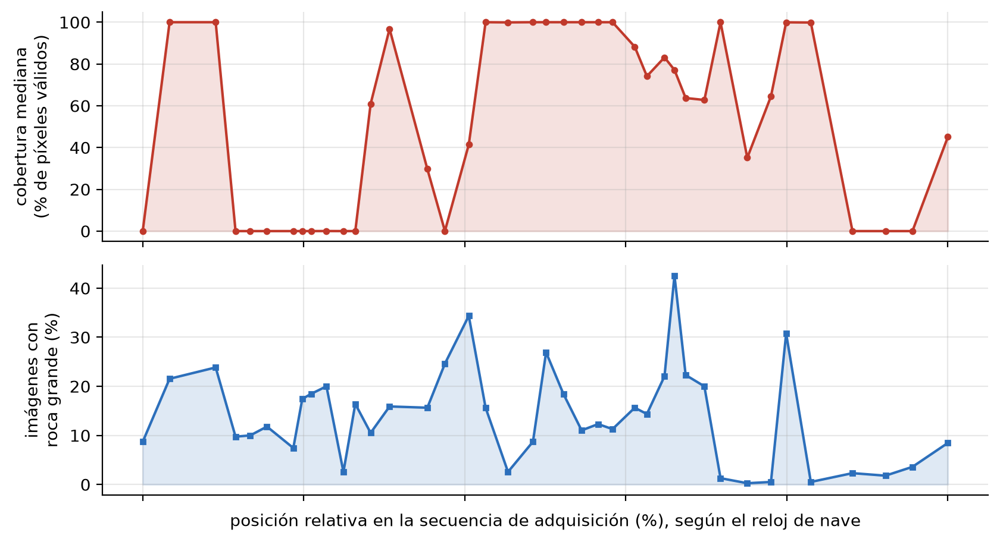

---

## 4. Contraste con las máscaras de experto (H3)

El dataset incluye 322 máscaras de especialistas, sobre **imágenes distintas** de las de
entrenamiento. Con el mismo código y los mismos parámetros:

| Indicador | Colaborativas | Experto |
|---|:---:|:---:|
| Cobertura mediana (escenas con roca) | 96,8 % | 46,1 % |
| Escenas con cobertura del 100 % | 41 % | 8 % |
| Fracción de escena etiquetada (mediana) | 0,58 | 0,59 |

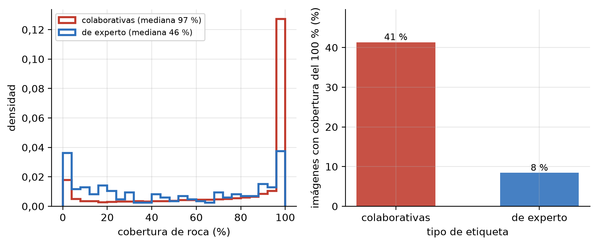

**La diferencia no puede atribuirse sin más a la anotación**: las dos fuentes cubren imágenes
distintas, y AI4Mars no distribuye máscara colaborativa para las imágenes de experto. Para
separar los efectos se usó un **instrumento común**: el segmentador entrenado (una función fija
de la imagen) aplicado a la región anotable de 593 escenas colaborativas no usadas en su
entrenamiento ni en su validación y de las 322 de experto.

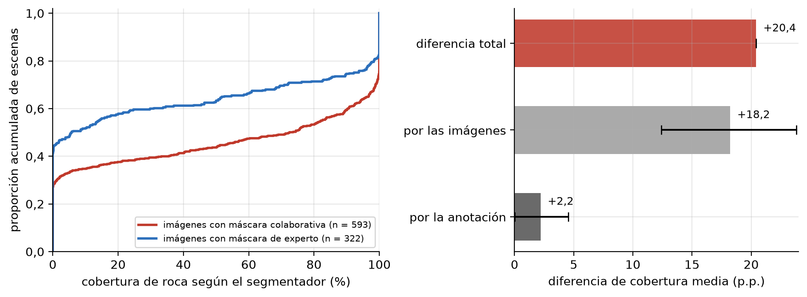

| Descomposición de la diferencia de medias | p.p. | IC 95 % por escena | IC 95 % por sol |
|---|---:|---|---|
| Diferencia total según la etiqueta | +20,4 | | |
| Atribuible a las **imágenes** | **+18,2 (89 %)** | [+12,4; +23,8] | |
| Atribuible a la **anotación** | **+2,2 (11 %)** | [+0,02; +4,54] | [−1,0; +5,5] |

1. **El conjunto de máscaras de experto está compuesto por escenas mucho menos rocosas**: medido
   por el mismo instrumento, su cobertura mediana es del 5,8 % frente al 72,5 %. Es una
   propiedad del dataset pertinente para cualquiera que evalúe contra ese conjunto.
2. La componente de anotación es pequeña, positiva en todas las variantes e **incierta**: +3,2
   [+1,0; +5,4] si la muestra colaborativa se toma solo de los bloques de prueba, y +4,4
   [+2,1; +6,5] con el modelo anterior. Las imágenes de experto se concentran en 48 soles; con
   un *bootstrap* que remuestrea soles completos, el intervalo de la muestra principal incluye
   el cero ([−1,0; +5,5]) y el de los bloques de prueba lo excluye por poco ([+0,2; +6,3]). Es
   **compatible** con la hipótesis de un sesgo de saliencia, pero el diseño no permite
   identificar causalmente ese mecanismo.
3. El mecanismo de un denominador reducido por suelo sin etiquetar **no encuentra apoyo**: la
   fracción etiquetada es igual en ambas fuentes (p = 0,24).

La descomposición supone que el error del instrumento es el mismo en las dos muestras. Un sesgo
común se cancela al restar; lo que la sesgaría es que el error dependa de la composición de la
escena, y depende del tramo de cobertura. Por eso la cifra de anotación es aproximada y el sentido
de su sesgo no puede determinarse con estos datos.

---

## 5. Validación con conteo humano (H2) — evaluación exploratoria

Un único observador contó, por bandas, las rocas que distingue **dentro de la región anotada**
como roca grande en 60 escenas (identificadores neutros, orden barajado, resultado automático
oculto). Los parámetros estaban congelados antes de la primera respuesta y ninguna escena de
calibración está en la muestra. Una ronda piloto de 24 escenas sirvió para corregir defectos
del instrumento (su banda abierta «10 o más» favorecía a los métodos que sobreestiman).

| Medida | Valor |
|---|---:|
| Acuerdo exacto de banda | 50 % |
| Kappa de Cohen | 0,13 [0,00; 0,27] |
| Kappa ponderado | 0,11 [0,01; 0,22] |
| Escenas por debajo / por encima del observador | **28 / 2** (prueba de signos p < 0,001) |

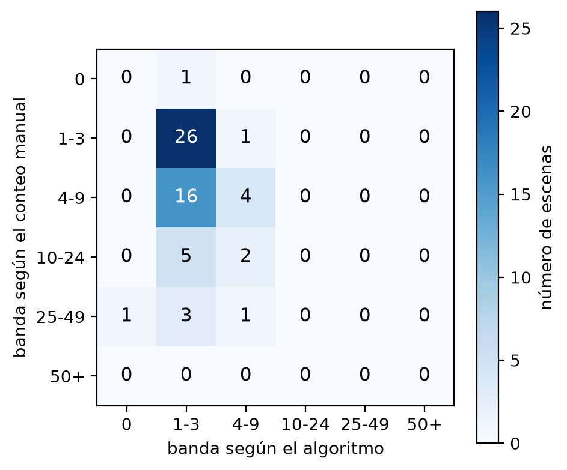

Con los parámetros fijados, el procedimiento nunca pasa de 9 rocas; el observador vio 10 o más
en 12 escenas. **No es un artefacto de la calibración**: en las 36 combinaciones de prominencia,
suavizado y área mínima ensayadas, el procedimiento queda por debajo del observador en entre
23 y 29 escenas.

**Por qué.** El observador contó dentro de la misma región que el procedimiento, así que el
desacuerdo se explica sobre todo porque **hay regiones sin información geométrica para separar
instancias**: la división de aguas solo corta donde la región se estrangula, y un polígono que
envuelve un campo de bloques contiguos no tiene dónde cortar. Aparte de ese desacuerdo, **la
anotación no es exhaustiva** (en 36 de 60 escenas la roca grande es menos del 20 % de la roca
etiquetada; mediana 9,1 %): ni un conteo exacto de la región equivaldría a las rocas de la escena.

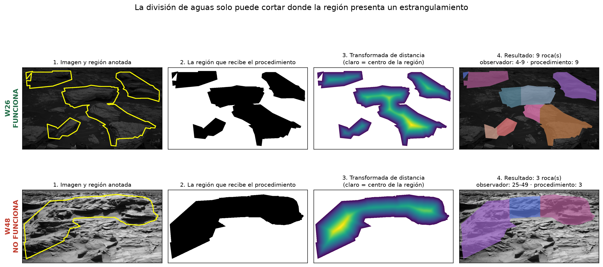

> **Alcance del indicador.** El procedimiento produce un conteo reproducible de las instancias
> geométricamente separables dentro de la clase *big rock*, pero ese conteo no puede
> interpretarse como estimación válida del número total de rocas visibles en la escena. La
> evaluación exploratoria con un observador sugiere un subconteo sistemático. Con un solo
> observador no se puede separar el desacuerdo algoritmo–persona de la variabilidad entre
> personas; su confirmación exige al menos dos observadores independientes.

**El límite está en la representación semántica.** El lecho rocoso aporta el 97,5 % de la roca
etiquetada y la roca grande el 2,5 %. Sobre las **mismas** 322 imágenes, la proporción de
escenas con roca grande cae del 16,5 % al 1,6 % al endurecer el acuerdo entre especialistas:
solo se conserva el 20 % de sus píxeles, frente al 44 % del lecho rocoso y más del 67 % del suelo y
la arena. Es la clase que menos consenso reúne también entre ellos. La evidencia indica que la
principal limitación del conteo de instancias proviene de la representación semántica y de la
granularidad de las etiquetas, más que de una falta de resolución evidente de las imágenes
(intervienen también consenso, perspectiva, escala, oclusión y parametrización).

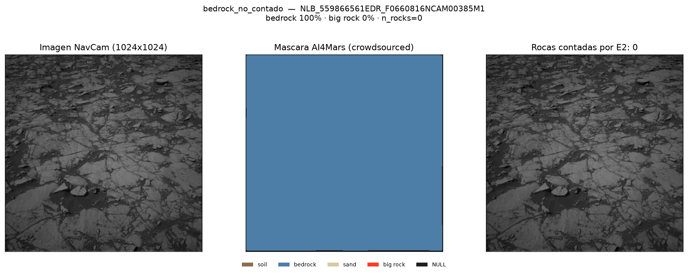

### Exploración: usar la imagen dentro de la región

Se compararon cuatro relieves derivados de la imagen (gradiente fino, gradiente grueso,
sombras por *top-hat* negro y combinación), con el mismo protocolo y el parámetro elegido por
validación cruzada dejando una escena fuera:

| Relieve | κ ponderado | Diferencia con E2 | IC 95 % | IC Bonferroni |
|---|---:|---:|---|---|
| Gradiente fino | 0,18 | +0,06 | [−0,14; +0,28] | [−0,19; +0,33] |
| Gradiente grueso | 0,08 | −0,03 | [−0,20; +0,13] | [−0,24; +0,17] |
| Sombras | 0,37 | +0,26 | [+0,03; +0,47] | [−0,03; +0,53] |
| Combinado | 0,27 | +0,15 | [−0,05; +0,36] | [−0,11; +0,41] |

**Ninguno mejora a E2 de forma demostrable** una vez corregido el número de métodos probados,
y todos desplazan el error hacia la sobreestimación. El enfoque híbrido queda como **prueba de
concepto** y trabajo futuro.

---

## 6. Comparación con aprendizaje automático

**Modelo general sin entrenamiento específico (FastSAM)**, 50 escenas restringido a la región de
roca: acuerdo por bandas del 52 % con el conteo clásico, correlación de rangos 0,45.

**Segmentador DeepLabV3 (ResNet-50)** entrenado con las máscaras colaborativas (roca / no-roca;
Adam, lr 1e-4, lote 4, 512 px, 6 épocas; sin aumentación; semilla 0). Diseño fijado antes de
entrenar:

- **Población:** escenas con fracción etiquetada ≥ 0,20 (14 490; se excluyen 1 111).
- **Reparto por bloques temporales:** 30 bloques consecutivos de reloj de nave (~75 soles cada
  uno) asignados al azar a entrenamiento, validación y prueba, con un margen de un sol: ninguna
  imagen de prueba está a menos de un sol de una de entrenamiento. El manifiesto
  `outputs/split_deeplab_manifiesto.csv` registra el bloque y la partición de cada escena.
- **Punto de control:** el de mejor mIoU de validación (época 4, 0,957); la prueba se evalúa una
  sola vez.

| Prueba | n | IoU medio | Correlación de la cobertura | Error absoluto medio |
|---|---:|---:|---:|---:|
| Muestra equilibrada | 400 | 0,940 | 0,971 | 3,5 |
| Distribución natural de los bloques de prueba | 2 323 | 0,932 | 0,971 | 3,7 |
| Excluidas por fracción etiquetada < 0,20 | 178 | 0,815 | 0,869 | 10,4 |

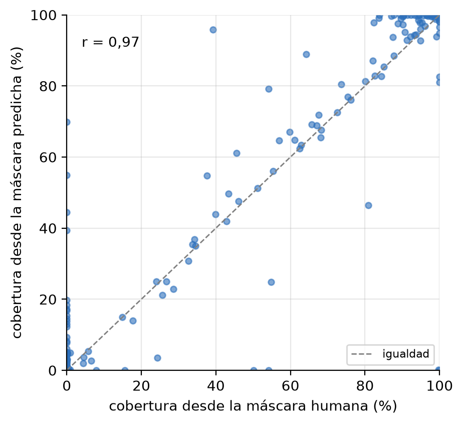

**Fuga de información.** Una versión anterior, con reparto al azar por imagen, tenía 75 imágenes
de prueba a menos de un minuto de una de entrenamiento y daba un IoU medio de 0,940 y una
correlación de 0,971: prácticamente lo mismo que el reparto por bloques. Aquella proximidad no
inflaba el desempeño.

**Frente al experto** (IoU medio 0,836; correlación 0,924):

| Error de cobertura (modelo − etiqueta) | Colaborativa (593) | Experto (322) |
|---|:---:|:---:|
| Error medio, IC 95 % | +0,93 [−0,08; +1,90] | +3,12 [+1,36; +4,95] |
| Error absoluto medio | 4,3 | 8,5 |
| Límites de acuerdo (Bland–Altman) | [−23,3; +25,2] | [−29,3; +35,6] |
| Escenas con error > 10 p.p. | 11,1 % | 28,0 % |

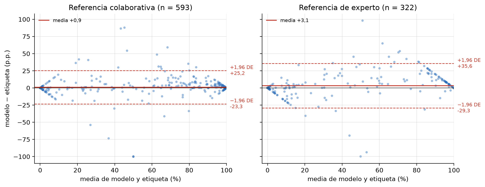

El modelo reproduce en promedio la anotación de la que aprendió, pero **sobreestima frente al
experto** unos tres puntos, la dirección esperable si heredó su criterio. Los errores
individuales son grandes y dependen del tramo, de modo que sirve para describir conjuntos de
escenas y no para valorar una escena concreta. Estima cobertura, no conteo.

---

## 7. Extensión aplicada (anexo de la tesis)

**Reglas heurísticas de priorización.** Seis reglas con umbral explícito ordenan escenas para revisión: 98 en prioridad
alta, 1 343 media, 124 baja. Las reglas de conteo solo se evalúan sobre la población de E2, y
el percentil que representa cada umbral lo calcula el guion. **No están calibradas para la navegación**: sin escala métrica, un
porcentaje de píxeles no permite inferir altura de un bloque, transitabilidad, daño a las
ruedas ni probabilidad de atrapamiento.

**Aplicación de consulta.** Aplicación de escritorio que hace consultable el conjunto de
resultados sin programar (resumen, priorización, explorador de escenas, geología).

```bash
python app.py
```

**Exploración de vetas** (resultado negativo, en anexo): un filtro de crestas mejora nueve veces
la tasa base pero recupera menos del 7 % de los píxeles de veta; el color no aporta.

---

## 9. Estructura del repositorio

```
├── src/                         módulos de cálculo
│   ├── config.py                rutas del dataset y codificación NAV
│   ├── mask_utils.py            lectura de máscaras y binarización
│   ├── coverage.py              cobertura de roca visible (E1)
│   ├── rock_count.py            conteo con división de aguas (E2)
│   ├── poblaciones.py           definición única de las poblaciones de E1 y E2
│   ├── rock_count_hybrid.py     exploración: máscara + gradiente de imagen
│   ├── features.py              composición y geometría de rocas
│   ├── pipeline.py              orquestación: una fila de resultados por imagen
│   ├── priorizacion.py          reglas heurísticas de priorización
│   ├── segmentation.py          segmentador DeepLabV3
│   ├── sam_compare.py           comparación con modelo fundacional
│   └── viz.py                   visualización de máscaras y etapas
│
├── scripts/                     guiones de ejecución
│   ├── run_pipeline.py          procesa el subconjunto → results.csv
│   ├── calibracion.py           reconstruye la calibración del conteo
│   ├── sensibilidad_parametros.py  36 combinaciones de h, σ y área mínima
│   ├── analisis_dependencia.py  Pearson, Spearman, correlación de distancia, información mutua
│   ├── eval_validation.py       acuerdo con el observador: kappa simple y ponderado
│   ├── eval_metodos_imagen.py   relieves de imagen con validación cruzada y Bonferroni
│   ├── train_segmentation.py    entrena el DeepLabV3 con reparto por bloques temporales
│   ├── eval_model_expert.py     segmentador frente a las máscaras de experto (por escena)
│   ├── eval_fuga_temporal.py    distancia en reloj de nave entre prueba y entrenamiento
│   ├── eval_fuente_anotacion.py instrumento común: imágenes frente a anotación
│   ├── eval_modelo_detalle.py   error con signo, bootstrap y Bland–Altman del segmentador
│   ├── compare_sam.py           comparación con FastSAM
│   ├── run_priorizacion.py      aplica las reglas de priorización
│   ├── make_thesis_figures.py   figuras del documento
│   ├── make_mechanism_figure.py figura del mecanismo del subconteo
│   ├── make_extension_figures.py  figuras de la priorización y de las vetas
│   ├── make_hybrid_figure.py    figura de la prueba de concepto híbrida
│   ├── diagnose_errors.py       paneles por modo de fallo
│   ├── explore_vein_detection.py  exploración de vetas
│   ├── make_validation_kit2.py  prepara la validación humana
│   ├── responder_validacion.py  interfaz para responderla
│   ├── generar_cifras.py        todas las cifras de la tesis → tesis/cifras.tex
│   └── generar_bibliografia.py  bibliografía desde Crossref/DataCite → tesis/references.bib
│
├── tests/                       pruebas de las reglas deterministas
├── manifiestos/                 escenas de calibración
├── tesis/                       documento en LaTeX (plantilla institucional)
├── docs/                        documentación de trabajo anterior
├── outputs/
│   ├── results.csv              24 columnas + 4 de elegibilidad × 16 064 escenas
│   ├── split_deeplab_manifiesto.csv  bloque y partición de cada escena en el segmentador
│   ├── figures/tesis/           figuras del documento
│   └── validacion_manual_v2/    respuestas de la validación humana
├── Makefile                     reproducción completa, en orden
├── app.py                       aplicación de escritorio
├── environment.yml              entorno con las versiones de la ejecución final
└── requirements-lock.txt        registro exacto de todos los paquetes
```

---

## 10. Reproducir

```bash
# 1. Entorno (versiones de la ejecución final; registro exacto en requirements-lock.txt)
conda env create -f environment.yml
conda activate tesis-marte

# 2. Dataset (~16 GB, no se versiona)
#    Descargar de https://doi.org/10.5281/zenodo.15995036 e indicar la ruta:
export AI4MARS_ROOT=/ruta/a/ai4mars-dataset-merged-0.6

# 3. Todo, en orden: pruebas, resultados, calibración, análisis, validación, segmentador,
#    evaluaciones, figuras, cifras de la tesis y documento
make todo

# Sin reentrenar el segmentador (~2 h), reutilizando el modelo ya entrenado:
make resultados

# Solo las pruebas
make pruebas
```

El modelo entrenado (~170 MB) no se versiona en git: se descarga de la versión publicada
[modelo-deeplab-v2](https://github.com/NotJaayz/mars-agent-research/releases/tag/modelo-deeplab-v2) y se copia a `outputs/`. Su huella SHA-256 está en
`outputs/segmentacion_metricas.json`. Las cifras de resultados del documento no se escriben a
mano: `scripts/generar_cifras.py` las extrae de `outputs/` y las escribe en `tesis/cifras.tex`.
Dos archivos son salidas congeladas del modelo anterior, que se conservan solo para la
comparación con el reparto al azar y no se regeneran:
`outputs/segmentacion_metricas_reparto_aleatorio.json` y
`outputs/fuente_anotacion_resumen_modelo_anterior.json`.

---

## 11. Alcance y limitaciones

**Alcance.** MSL NavCam (*Curiosity*), etiquetas de entrenamiento. Quedan fuera MER,
Perseverance y MastCam. El proyecto no genera máscaras nuevas, no modela evolución temporal
ni usa datos de elevación.

**Limitaciones declaradas:**

- **Las coberturas describen el terreno tal como lo registra la anotación colaborativa**; con
  máscaras de especialista serían algo menores. Sirven para comparar escenas del mismo
  conjunto.
- **Sin escala métrica.** Los tamaños son relativos al campo de visión; el subconjunto es casi
  enteramente monocular (16 027 imágenes del ojo izquierdo frente a 37 del derecho).
- **Un solo observador** en la validación del conteo: las conclusiones sobre H2 son
  exploratorias.
- **El conteo** mide instancias geométricamente separables en la clase *big rock*, no el número
  de rocas visibles.

---

## Créditos

Dataset **AI4Mars** — Swan, R. M., Atha, D., Leopold, H. A., Gildner, M., Oij, S., Chiu, C.,
y Ono, M. (2021). *AI4Mars: A Dataset for Terrain-Aware Autonomous Driving on Mars.*
IEEE/CVF CVPR Workshops. Imágenes: NASA/JPL-Caltech.

Las máscaras existen gracias al trabajo de miles de voluntarios del proyecto AI4Mars en
Zooniverse. Las diferencias entre fuentes de anotación que este trabajo documenta son
propiedades del diseño del conjunto y de la tarea, **no una deficiencia atribuible a quienes
la realizaron**.
