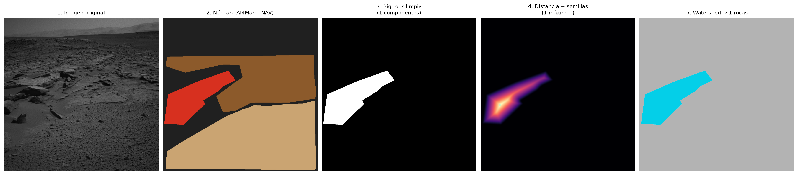
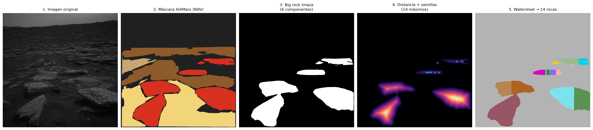
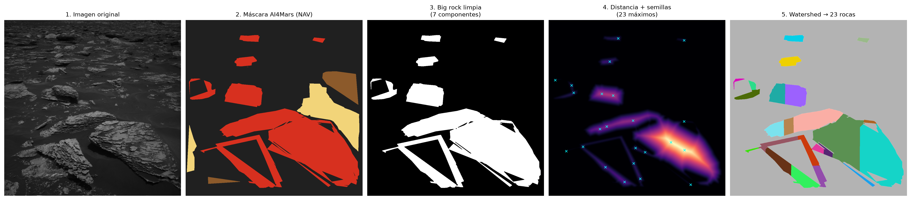
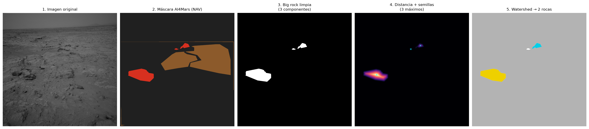

# Figures and captions for the document

**🌐 Language:** [Español](figuras_tesis.md) · **English**

The images live in `outputs/figures/tesis/` and are produced by
`python scripts/make_thesis_figures.py`. They are generated **without an embedded title**,
because in an academic document that role belongs to the caption; it is enough to insert
the image and copy the corresponding caption.

Numbering continues that of the proposal, which ends at Figure 10. The annex collects the
additional step-by-step panels, satisfying the commitment in §8.9 to document at least five
representative images.

| No. | File | Cited in |
|:--:|---|---|
| 11 | `Figura_11_procedimiento_paso_a_paso.png` | Results, §1 |
| 12 | `Figura_12_banderas_calidad.png` | Results, §1 |
| 13 | `Figura_13_distribucion_cobertura.png` | Results, §2 |
| 14 | `Figura_14_cobertura_vs_fraccion_etiquetada.png` | Results, §2 |
| 15 | `Figura_15_conteo_por_bandas.png` | Results, §3 |
| 16 | `Figura_16_tamano_frecuencia.png` | Results, §3.1 |
| 17 | `Figura_17_tipologia_escenas.png` | Results, §4 |
| 18 | `Figura_18_variacion_recorrido.png` | Results, §5 |
| 19 | `Figura_19_validacion_experto.png` | Results, §6 |
| 20 | `Figura_20_matriz_acuerdo.png` | Results, §7 |
| 21 | `Figura_21_cobertura_modelo_vs_humano.png` | Results, §7 |
| 22 | `Figura_22_subdivision_afloramiento.png` | Discussion, §10 |
| A1–A4 | `Figura_A1…A4_procedimiento_anexo_*.png` | Annex |

---

## Captions

**Figure 11.** *Step-by-step procedure applied to a scene with several rocks.*

> Note. From left to right: original navigation-camera image; AI4Mars mask with the four
> terrain classes (red, big rock; brown, bedrock; beige, sand; dark grey, unlabelled);
> binary big-rock mask after morphological cleaning, showing the two resulting connected
> components; distance transform, where lighter tones indicate greater distance from the
> edge, with the five local maxima marked by crosses; and the final watershed partition, in
> which each colour corresponds to one of the five counted rocks. Parameters: minimum area
> of 0.05% of the image area, minimum separation between maxima of 15 pixels,
> distance-transform smoothing with σ = 3.0, and maximum aspect ratio of 5. Image
> `NLB_436473759EDR_F0211572NCAM00464M1`. Source: own elaboration from AI4Mars
> (NASA/JPL-Caltech).

**Figure 12.** *Composition of the analysed set by quality flag.*

> Note. Distribution of the 16,064 MSL NavCam images with an available mask. Only 13.7%
> contain big rock and are therefore eligible for counting, while a further 52.7% contain
> rock without individual blocks to count. The remaining 2.9% are discarded for having more
> than 95% of the scene unlabelled or for lacking labels entirely. Source: own elaboration.

**Figure 13.** *Distribution of visible rock coverage in its two versions.*

> Note. Histograms over the 10,817 images containing rock. Left: coverage computed over
> labelled pixels, the indicator defined in §8.6. Right: the same quantity referred to the
> whole image, which constitutes a conservative lower bound. The dashed line marks the median
> in each case: 96.8% and 42.0% respectively. The distribution is bimodal, with a marked
> accumulation at the upper end corresponding to 4,471 images whose labelled area is entirely
> rock. Source: own elaboration.

**Figure 14.** *Rock coverage against the labelled fraction of the scene.*

> Note. Hexagonal density plot, with a logarithmic colour scale, for the labelled images. The
> absence of structure and a correlation of r = −0.02 indicate that coverage does not depend
> on the proportion of the scene that received labels, which rules out high values being an
> artefact of sparsely annotated images. Source: own elaboration.

**Figure 15.** *Distribution of the number of rocks counted per image.*

> Note. Over the 2,193 images containing big rock. The first bar corresponds to the 421
> images in which pixels of the class exist but no region passes the minimum-area and shape
> filters. The median is two rocks per image and the observed maximum is 23. Source: own
> elaboration.

**Figure 16.** *Size–frequency distribution of the counted rocks.*

> Note. Classification of the 5,297 measured rocks by their area relative to the image size.
> The decreasing shape — predominance of small rocks and falling frequency as size increases
> — agrees qualitatively with the distributions described in landing-site rock-abundance
> studies, although sizes here are relative to the field of view rather than metric
> magnitudes. Source: own elaboration.

**Figure 17.** *Scene typology according to terrain composition.*

> Note. Classification of the 16,064 images from the proportion of each class over their
> valid pixels: rocky when rock reaches at least 66%, sandy or soil when the corresponding
> class exceeds 50%, and mixed when none predominates. Almost half of the scenes are rocky.
> Source: own elaboration.

**Figure 18.** *Rock coverage and presence of big rock along the traverse.*

> Note. Images were ordered by the spacecraft clock contained in their identifier, which
> grows monotonically with time, and grouped into forty segments with an equal number of
> images. The upper panel shows the median coverage of each segment and the lower one the
> percentage of images containing big rock. An alternation between markedly rocky segments
> and soil or sand segments is apparent, with local concentrations of big rock. The
> horizontal axis reflects acquisition order and not sol or distance travelled, so it should
> be read as a relative ordering. Source: own elaboration.

**Figure 19.** *Coverage comparison between crowdsourced and expert labels.*

> Note. Left: normalised coverage distributions for the crowdsourced masks used in the
> analysis and for the 322 expert masks with 100% agreement included in the dataset. Right:
> percentage of images in which the entire labelled area is rock. The discrepancy is
> systematic: the median falls from 96.8% to 46.1% and the share of total coverages drops
> from 42% to 8%, evidencing a bias towards rock in the crowdsourced annotation. Source: own
> elaboration.

**Figure 20.** *Agreement matrix between the classical procedure and a general segmentation model.*

> Note. Each cell gives the number of images, from a sample of fifty containing big rock,
> whose count falls in the row band according to the classical procedure and in the column
> band according to the general model without domain-specific training. The diagonal collects
> the matching cases, which account for 44% of the total. Cells above the diagonal correspond
> to overcounting by the model and those below to undercounting. Source: own elaboration.

**Figure 21.** *Coverage estimated by the trained model versus that derived from human annotation.*

> Note. Each point is a test-set image, not used during training. The horizontal axis gives
> the coverage computed on the AI4Mars mask and the vertical axis the coverage computed on
> the mask predicted by the DeepLabV3 segmenter from the image alone. The dashed line marks
> perfect equality. Source: own elaboration.

**Figure 22.** *Subdivision of a continuous region labelled as big rock.*

> Note. Scene with elongated, concave-contoured regions. Although the annotation delimits a
> few continuous strips, the distance transform shows several ridges and the watershed
> separates them into four regions, illustrating the limitation described in the discussion.
> The mean solidity of the accepted regions, included in the results table, allows such cases
> to be flagged automatically. Image `NLB_614913932EDR_F0761384NCAM00294M1`. Source: own
> elaboration from AI4Mars (NASA/JPL-Caltech).

---

## Annex

**Figure A1.** *Step-by-step procedure: scene with a single isolated rock.*

> Note. Simplest case of the procedure: the mask delimits a single block, the distance
> transform shows a single maximum and the watershed introduces no partition. Image
> `NLB_448901529EDR_F0300740NCAM00256M1`.

**Figure A2.** *Step-by-step procedure: cluster of adjacent rocks.*

> Note. Several rocks appear in contact and form a single blob in the binary mask. The local
> maxima of the distance transform allow them to be separated, which is precisely the
> situation that justifies using the watershed. Image
> `NLB_547801039EDR_F0630346NCAM07753M1`.

**Figure A3.** *Step-by-step procedure: rock-dense scene.*

> Note. Scene with the highest rock count in the analysed set. It illustrates the behaviour
> of the procedure at the upper end of the counting range. Image
> `NLB_550010635EDR_F0632582NCAM00282M1`.

**Figure A4.** *Step-by-step procedure: high-coverage scene dominated by bedrock.*

> Note. Rock coverage is practically total, yet the big-rock class occupies a small extent,
> so the count is low. It exemplifies the independence between the two indicators discussed
> in the results. Image `NLA_407351345EDR_F0050406NCAM00340M1`.
