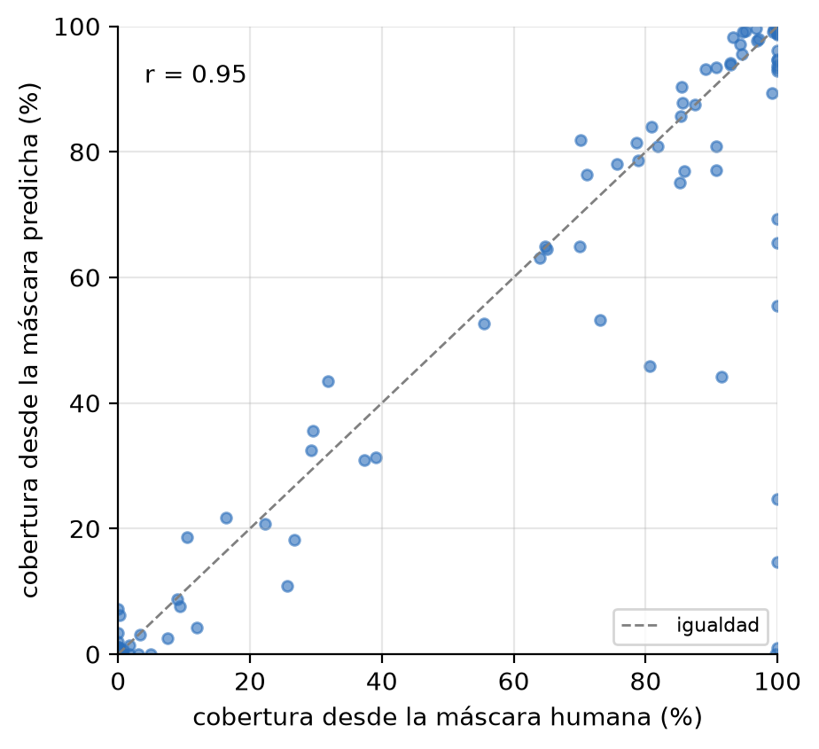

# Results, discussion and limitations

**🌐 Language:** [Español](resultados_discusion.md) · **English**

> Draft of the results and discussion chapters, written from the execution of the
> procedure over the study subset. Figure numbering continues that of the proposal
> (which ends at Figure 10). Figure paths are given in each callout.

---

# Chapter: Results

## 1. Analysed set

The procedure was executed over the **16,064 images** from the navigation camera of the
Curiosity rover (MSL NavCam) that have a training mask in AI4Mars. Figure 11 illustrates
the complete procedure on a representative scene: original image, AI4Mars mask, cleaned
binary mask, distance transform with the detected seeds, and the final counting result.

> **Figure 11.** Step-by-step procedure on a scene with several rocks.
>

Each image received a quality flag summarising its suitability for each indicator
(Table 2, Figure 12):

| Flag | Meaning | Images | % |
|---|---|---:|---:|
| `ok` | Contains big rock; suitable for coverage and counting | 2,193 | 13.7 |
| `no_bigrock` | Contains rock, but no big rock to count | 8,458 | 52.7 |
| `no_rock` | Labelled, without rock | 4,950 | 30.8 |
| `mostly_null` | More than 95% unlabelled | 300 | 1.9 |
| `empty` | No labelled pixel at all | 163 | 1.0 |

> **Table 2.** Composition of the set by quality flag.

> **Figure 12.** Composition of the analysed set by quality flag.

The fraction of the scene effectively labelled has a median of **0.58**: slightly more
than half of each image received a label, while the remainder corresponds to the rover
body, the sky and distances beyond 30 metres, which the dataset itself excludes.

## 2. Visible rock coverage (E1)

Of the 16,064 images, **10,817 (67.3%)** contain some visible rock pixel (bedrock or big
rock). Over that set:

| Measure | Median | Mean |
|---|---:|---:|
| Coverage over labelled pixels | 96.8% | 75.1% |
| Coverage over the whole image | 42.0% | 41.9% |

The distribution (Figure 13) is markedly **bimodal**: it accumulates at the extremes, with
4,471 images in which the entire labelled area is rock, and a second group with zero
coverage. In total, 8,339 images exceed 50% coverage.

> **Figure 13.** Distribution of coverage, in its two versions.
>

The difference between the two measures comes from unlabelled pixels. Both are reported
because they serve different purposes: the first answers *what fraction of the classified
terrain is rock* — the definition in the proposal — and the second offers a conservative
lower bound over the complete scene.

Given the possibility that high coverage values were an artefact of sparsely labelled
images, coverage was contrasted against the labelled fraction of the scene (Figure 14).
The correlation is **essentially null (r = −0.02)**: coverage does not depend on how much
was labelled, so high values correspond to scenes genuinely dominated by bedrock rather
than to a bias of the formula.

> **Figure 14.** Coverage against the labelled fraction of the scene.
>

## 3. Approximate count of individual rocks (E2)

Counting was applied to the **2,193 images** containing big rock and yielded a total of
**4,204 rocks**, with a median of **1 rock per image** and a maximum of 20. The
distribution by bands (Figure 15) is as follows:

| Rocks per image | Images | % |
|---|---:|---:|
| 0 (discarded by the filters) | 453 | 21 |
| 1 | 772 | 35 |
| 2–3 | 613 | 28 |
| 4–9 | 344 | 16 |
| 10 or more | 11 | 1 |

> **Figure 15.** Distribution of the rock count per image.
>

The first row deserves attention: in **453 images (21% of the eligible ones)** there are
big-rock pixels but no region passes the minimum-area and shape filters. These are very
small or very elongated annotations, which the procedure discards by design; the figure is
reported explicitly because it delimits the actual reach of the indicator.

On average, each eligible image contains 2.25 connected components before the watershed
step and 1.89 rocks afterwards, indicating that the watershed introduces a moderate
subdivision rather than a massive fragmentation.

### 3.1 Size–frequency distribution

Classifying the 4,141 measured rocks by their size relative to the image area (Figure 16):

| Size class | Rocks | % |
|---|---:|---:|
| Small (< 0.5% of the area) | 1,805 | 44 |
| Medium (0.5 – 2%) | 1,317 | 32 |
| Large (≥ 2%) | 1,019 | 25 |

> **Figure 16.** Size–frequency distribution of the counted rocks.
>

The result is a **decreasing distribution**: small rocks predominate and frequency falls as
size increases. This shape agrees qualitatively with the size–frequency distributions
described in landing-site rock-abundance studies, although here sizes are relative to the
field of view rather than metric, so the comparison concerns shape and not magnitude.

The largest recorded rock occupies 89.8% of the labelled area of its scene. The mean
solidity of the accepted regions is 0.912, i.e. compact shapes; only 20 images show a mean
solidity below 0.7, a sign of concave contours or of regions possibly subdivided in excess.

## 4. Terrain composition and scene typology (E3)

Beyond the two planned indicators, each image was characterised by the proportion of each
class over its labelled pixels. The mean composition is: **bedrock 49.8%, soil 36.4%, sand
12.5% and big rock 1.3%**. The dominant class is bedrock in 8,234 images, soil in 5,767,
sand in 1,792 and big rock in only 108.

From that composition a scene typology was defined (Figure 17):

| Scene type | Criterion | Images | % |
|---|---|---:|---:|
| Rocky | rock ≥ 66% | 7,601 | 47.3 |
| Soil | soil ≥ 50% | 5,723 | 35.6 |
| Sandy | sand ≥ 50% | 1,742 | 10.8 |
| Mixed | no class predominates | 835 | 5.2 |

> **Figure 17.** Scene typology according to terrain composition.
>

A result relevant to their joint interpretation is that coverage and count are
**practically independent indicators**: among eligible images their correlation is
**r = 0.02**. A scene may be almost entirely covered by continuous bedrock and contain no
countable rock, or show little coverage and several isolated blocks. The two indicators
therefore describe different aspects of the terrain and are not redundant.

## 5. Variation along the traverse (E3)

Ordering the images by the spacecraft clock included in their identifier — which grows
monotonically with time and serves as a proxy for progress along the traverse — and
grouping them into segments with an equal number of images, a **clear alternation between
markedly rocky segments and soil or sand segments** is observed (Figure 18), with local
concentrations of big rock reaching up to 40% of the images in a segment.

> **Figure 18.** Coverage and presence of big rock along the traverse.
>

This reading answers directly the question raised in the introduction about which
stretches of the traverse concentrate visible rock. It should be interpreted as a relative
ordering and not as a calibrated time series, since the axis reflects acquisition order and
not sol or distance travelled.

It is worth noting that the subset comes almost entirely from the left camera of the
stereo pair (16,027 images versus 37 from the right), so a comparison between eyes was not
possible.

## 6. Validation against expert labels

The dataset includes 322 masks labelled by specialists with 100% agreement. The same
procedure was run on them, without changing parameters, and compared with the crowdsourced
masks used in the main analysis (Figure 19):

| Indicator | Crowdsourced | Expert |
|---|:---:|:---:|
| Median coverage | 96.8% | **46.1%** |
| Images with 100% coverage | 42% | **8%** |
| Bedrock pixels | 49% | 31% |
| Soil + sand pixels | 50% | **69%** |
| Images with big rock | 13.7% | 16.5% |

> **Figure 19.** Coverage comparison between crowdsourced and expert labels.
>

The discrepancy is systematic and large for coverage, whereas the presence of big rock and
the count are comparable (median of 2 rocks versus 1). The discussion section analyses this
difference.

## 7. Comparison with machine-learning methods

As a complementary exploration, the procedure was contrasted with two machine-learning
approaches, both executed on local hardware.

**General model without domain-specific training.** A foundation segmentation model
(Segment Anything, FastSAM variant) was applied to 50 images containing big rock,
restricting its regions to the area labelled as rock. Agreement with the classical count,
measured by bands, is **52%**, with a rank correlation of 0.45 and a mean absolute error of
2.6 rocks (Figure 20). The model tends to subdivide a single rock according to its internal
texture and, in other scenes, to miss low-contrast blocks.

> **Figure 20.** Agreement matrix between the classical count and the general model.
>

**Model trained on the masks themselves.** A DeepLabV3 segmenter was trained by transfer
learning to distinguish rock from non-rock, using the AI4Mars masks as labels and reserving
validation and test sets. From the predicted mask, coverage was recomputed and compared
with the one derived from the human mask (Figure 21). Results are reported in Table 3.

Training used 2,000 images, with 400 for validation and 400 for testing, sampled in a
balanced way between scenes with and without rock. It ran for six epochs at a resolution of
512 pixels on a laptop with integrated GPU acceleration, at a cost of approximately thirteen
minutes per epoch. Unlabelled pixels were excluded both from the loss function and from the
metric computation.

> **Table 3.** Performance of the DeepLabV3 segmenter on the test set and agreement of the
> coverage indicator derived from its predictions.

| Measure | Value |
|---|---:|
| IoU of the non-rock class | 0.955 |
| IoU of the rock class | 0.925 |
| Mean IoU | **0.940** |
| Correlation of predicted with human coverage (n = 200) | **0.950** |
| Mean absolute error of coverage | 4.3 percentage points |

The model reaches a mean IoU of 0.940 on images unseen during training, and the coverage
computed from its predictions correlates at 0.950 with the one obtained from human
annotation, with a mean absolute error of just 4.3 percentage points. Figure 21 shows that
the points cluster tightly around the identity line; the largest discrepancies concentrate
in scenes of total coverage, where the model tends to fall short.

> **Figure 21.** Coverage estimated by the trained model versus that derived from human
> annotation, over the 200 test-set images.

---

# Chapter: Discussion and limitations

## 8. Interpretation of the indicators

This work confirms that the AI4Mars masks can be read as quantitative maps and not only as
training input. The two proposed indicators were obtained for the entire subset and proved
interpretable without knowledge of the procedure's details: 90% coverage describes a scene
dominated by rock, and a count of eight blocks describes terrain with discrete obstacles.

The finding that both indicators are **statistically independent** (r = 0.02) reinforces
the decision to report them separately. Coverage measures *how much* rock there is; the
count measures *how it is organised*. A continuous outcrop produces maximum coverage and a
null count; a field of scattered blocks produces the opposite. For trafficability
applications both facets matter, and neither replaces the other.

## 9. The bias of crowdsourced annotation

The most relevant result of the validation is that coverage computed on crowdsourced masks
**systematically overestimates** the proportion of rock: the median falls from 96.8% to
46.1% when expert masks are used, and the share of images with total coverage drops from
42% to 8%.

The most plausible explanation is a saliency bias in the annotation task: rock is visually
prominent and easy to delineate, whereas soil and sand are extensive, homogeneous surfaces
whose delineation is tedious and less obvious. Because agreement between annotators is
required, soil and sand pixels without consensus remain "unlabelled" and disappear from the
denominator, which raises the rock fraction. The composition confirms this mechanism:
experts label 69% of soil and sand pixels versus 50% in the crowdsourced masks.

It is important to be precise about the scope of this limitation. The computation itself is
not biased: applied to expert masks it returns plausible values. The bias resides in the
input data. Consequently, **the reported coverages should be read as relative to the
crowdsourced set** and not as absolute estimates of rock abundance on the terrain. For
comparisons between scenes of the same set — the intended use of the indicators — the bias
is largely common and does not invalidate the ordering; for absolute figures, the
appropriate reference is the expert subset.

The null correlation between coverage and labelled fraction (r = −0.02) rules out an
alternative explanation: the problem is not *how much* was labelled, but *which classes*
were labelled.

## 10. Subdivision of continuous outcrops

The limitation anticipated in the methodology was confirmed. When a region labelled as big
rock is extensive and continuous — an outcrop rather than a loose block — the distance
transform shows several ridges and the watershed subdivides it, even though geologically it
corresponds to a single unit (Figure 22).

> **Figure 22.** Case of subdivision in a scene with elongated, concave regions.
>

Parameter calibration bounded the effect but did not eliminate it. The initial setting —
minimum separation between maxima of 15 pixels and distance-transform smoothing of 3.0 —
markedly reduced spurious maxima: in one test scene, detected maxima fell from more than a
hundred to a number consistent with the visible rocks. Tightening those parameters further,
however, reduces outcrop subdivision at the cost of underestimating the count in scenes with
genuinely distinct clusters, so that route merely moves the problem along a trade-off.

To break that trade-off a different criterion was introduced: **prominence-based suppression
of maxima**, known as the h-maxima transform. Instead of requiring maxima to be separated by
a minimum distance — a purely geometric criterion — those whose height above their
surroundings falls below a threshold h are discarded. The difference is conceptual: a
low-prominence maximum corresponds to a minor undulation inside a continuous region, whereas
two genuinely distinct rocks produce maxima separated by a deep valley. The criterion
therefore acts on the cause of the problem rather than on one of its symptoms.

Verification confirms this selective behaviour. With h = 1 pixel, on the images previously
flagged as suspicious the count drops by between 32% (those with mean solidity below 0.7) and
44% (those with more than fifteen rocks), while in normal scenes — one to five rocks and
compact regions — **no count is altered at all**. The correction acts where there was error
and leaves untouched what was already right. Across the full set, the number of images with
more than fifteen rocks falls from nine to three, and the total counted goes from 5,375 to
4,204 rocks.

One side effect is worth noting because it illustrates why the correction is sound: mean
solidity decreases slightly (from 0.926 to 0.912) and the number of images with low solidity
rises. Far from indicating a deterioration, this reflects that irregular outcrops are no
longer split into artificially compact fragments but kept whole, with the concave shape they
actually have. As a consequence, solidity changes meaning: it no longer flags possible
excessive subdivision, but genuinely irregular regions that should not be read as discrete
blocks.

## 11. The scarcity of the "big rock" class

The big-rock class proved considerably less frequent than anticipated: it appears in 13.9%
of the masks and accounts on average for 1.3% of labelled pixels. This has two consequences.

The first concerns scope: counting applies to some 2,200 images instead of the 16,000 in the
set, and of those, 421 end at zero after filtering. The counting indicator is therefore
sound but of limited coverage, and the work reports it as an analysis over the scenes that
contain big rock, reserving coverage as the primary indicator.

The second is methodological and affects future work: any model attempting to predict the
big-rock class will face extreme class imbalance. This consideration motivated framing the
machine-learning exploration in binary terms — rock versus non-rock — which is far more
balanced.

## 12. On the machine-learning methods

The two approaches explored lead to a nuanced conclusion.

The general model without domain-specific training **does not reproduce** the classical
count: it agrees on the counting band in 52% of cases. The reason is not a failure of the
model but a difference of definition. The model segments by visual appearance and delimits
homogeneous texture regions; the classical procedure counts blocks within a semantic
annotation. Faced with a rock bearing veins or strong shadows, the former identifies several
regions and the latter a single one. Both are consistent with their own notion of an object,
but they are not interchangeable. This result justifies the claim that a general-purpose
model is insufficient for the Martian domain and that domain-specific tuning is required.

The model trained on the masks themselves does look promising for coverage: from the image
alone it reaches a high correlation with the indicator derived from human annotation. This
empirically supports the possibility, raised in the statement of the problem, of using the
obtained indicators as a reference for training models that predict them. It should be
stressed that the model learns to reproduce the crowdsourced annotations, bias included; it
reproduces the indicator, not the ground truth of the terrain.

## 13. Limitations of the study

1. **Bias of the input annotation**, discussed in section 9: coverages are relative to the
   crowdsourced set.
2. **Scope of the count**, limited to scenes containing big rock (section 11).
3. **Subdivision of continuous outcrops**, corrected through prominence-based suppression
   and verified as selective, although it cannot be entirely ruled out in highly irregular
   geometries (section 10).
4. **Measures relative to the field of view.** All sizes are expressed as a fraction of the
   image area. Without range information or geometric calibration they cannot be converted
   to metric magnitudes, so comparisons are valid between images from the same camera but
   not against metric inventories in the literature.
5. **Cross-sectional design.** Each image is treated independently; the traverse reading is
   a relative ordering and not a calibrated time series.
6. **Scope of the subset.** Only MSL NavCam with training labels; results are not
   extrapolated to other missions or cameras without repeating the analysis.
7. **Pending human validation.** The contrast with manual band-based counts remains as a
   closing task.

## 14. Future work

- **Correcting the annotation bias**, using the expert subset to estimate an adjustment
  factor or to retrain on more complete labels.
- **Extending the learned approach to counting**, feeding the predicted masks into the
  watershed procedure to close the second indicator as well.
- **Conversion to metric magnitudes** by incorporating the dataset's range products, which
  would allow comparison with rock-abundance inventories.
- **Application to other missions and cameras**, in particular the Perseverance set, where
  big rock is markedly more frequent.
