# Resultados, discusión y limitaciones

**🌐 Idioma:** **Español** · [English](resultados_discusion.en.md)

> Borrador de los capítulos de resultados y discusión, redactado a partir de la ejecución
> del procedimiento sobre el subconjunto de estudio. La numeración de figuras continúa la
> de la propuesta (que llega hasta la Figura 10). Las rutas de las figuras se indican en
> cada llamado.

---

# Capítulo: Resultados

## 1. Conjunto analizado

El procedimiento se ejecutó sobre las **16 064 imágenes** de la cámara de navegación del
rover Curiosity (MSL NavCam) que cuentan con máscara de entrenamiento en AI4Mars. La
Figura 11 ilustra el procedimiento completo sobre una escena representativa: imagen
original, máscara de AI4Mars, máscara binaria depurada, transformada de distancia con las
semillas detectadas y resultado final del conteo.

> **Figura 11.** Procedimiento paso a paso sobre una escena con varias rocas.
>

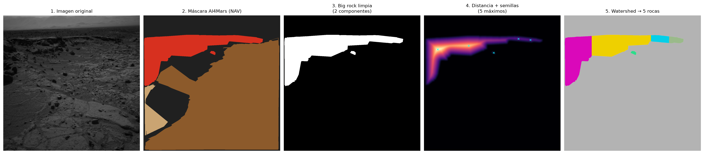

Cada imagen recibió una bandera de calidad que resume su aptitud para cada indicador
(Cuadro 2, Figura 12):

| Bandera | Significado | Imágenes | % |
|---|---|---:|---:|
| `ok` | Contiene roca grande; apta para cobertura y conteo | 2 193 | 13,7 |
| `no_bigrock` | Contiene roca, pero sin roca grande que contar | 8 458 | 52,7 |
| `no_rock` | Etiquetada, sin roca | 4 950 | 30,8 |
| `mostly_null` | Más del 95 % sin etiqueta | 300 | 1,9 |
| `empty` | Sin ningún píxel etiquetado | 163 | 1,0 |

> **Cuadro 2.** Composición del conjunto según la bandera de calidad.

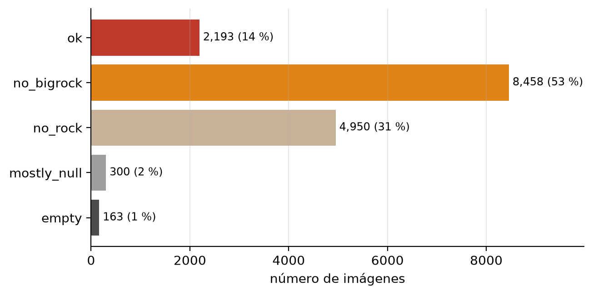

> **Figura 12.** Composición del conjunto analizado según la bandera de calidad.

La fracción de escena efectivamente etiquetada tiene una mediana de **0,58**: algo más de
la mitad de cada imagen recibió etiqueta, mientras el resto corresponde al cuerpo del
rover, al cielo y a las distancias superiores a 30 metros, que el propio dataset excluye.

## 2. Cobertura de roca visible (E1)

De las 16 064 imágenes, **10 817 (67,3 %)** contienen algún píxel de roca visible (lecho
rocoso o roca grande). Sobre ese conjunto:

| Medida | Mediana | Media |
|---|---:|---:|
| Cobertura sobre píxeles etiquetados | 96,8 % | 75,1 % |
| Cobertura sobre la imagen completa | 42,0 % | 41,9 % |

La distribución (Figura 13) es marcadamente **bimodal**: se acumula en los extremos, con
4 471 imágenes en las que la totalidad del área etiquetada es roca y un segundo grupo con
cobertura nula. En total, 8 339 imágenes superan el 50 % de cobertura.

> **Figura 13.** Distribución de la cobertura, en sus dos versiones.
>

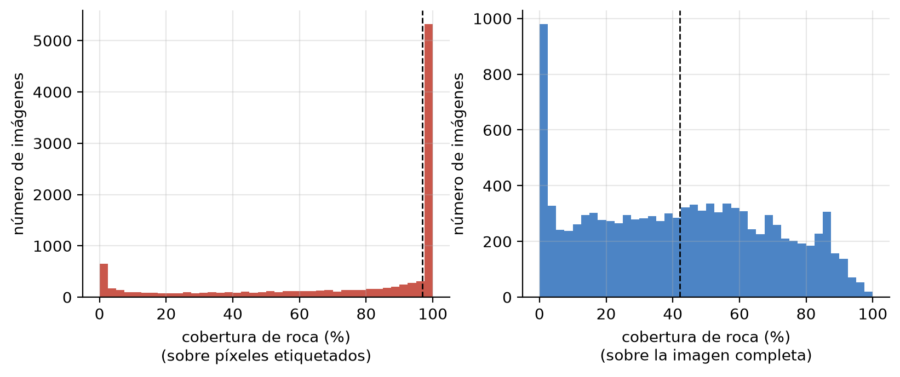

La diferencia entre ambas medidas proviene de los píxeles sin etiqueta. Se reportan las
dos porque cumplen funciones distintas: la primera responde *qué fracción del terreno
clasificado es roca* —la definición del anteproyecto— y la segunda ofrece una cota
inferior conservadora sobre la escena completa.

Ante la posibilidad de que las coberturas altas fueran un artefacto de imágenes
escasamente etiquetadas, se contrastó la cobertura con la fracción de escena etiquetada
(Figura 14). La correlación es **prácticamente nula (r = −0,02)**: la cobertura no depende
de cuánto se etiquetó, de modo que los valores altos corresponden a escenas
genuinamente dominadas por lecho rocoso y no a un sesgo de la fórmula.

> **Figura 14.** Cobertura frente a fracción de escena etiquetada.
>

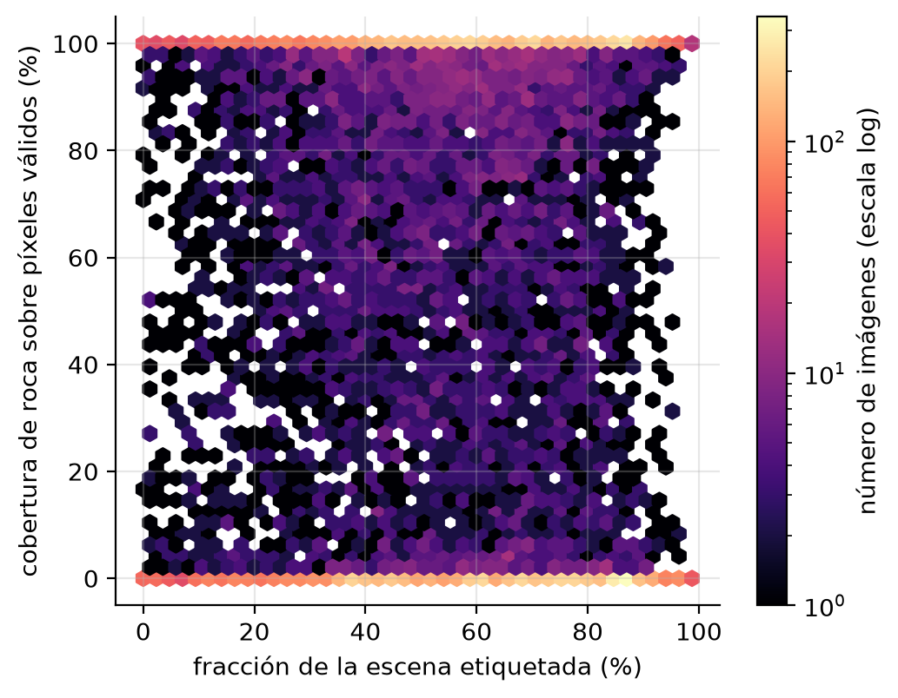

## 3. Conteo aproximado de rocas individuales (E2)

El conteo se aplicó a las **2 193 imágenes** que contienen roca grande, y arrojó un total
de **5 375 rocas**, con una mediana de **2 rocas por imagen** y un máximo de 23. La
distribución por bandas (Figura 15) es la siguiente:

| Rocas por imagen | Imágenes | % |
|---|---:|---:|
| 0 (descartadas por los filtros) | 421 | 19 |
| 1 | 630 | 29 |
| 2–3 | 615 | 28 |
| 4–9 | 481 | 22 |
| 10 o más | 46 | 2 |

> **Figura 15.** Distribución del conteo de rocas por imagen.
>

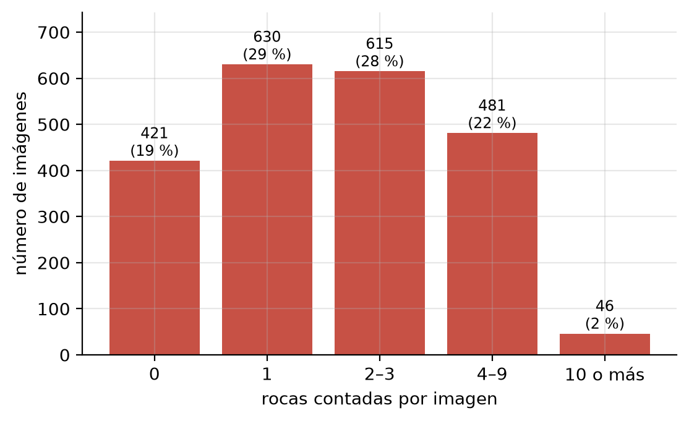

Conviene notar el primer renglón: en **421 imágenes (19 % de las aptas)** existen píxeles
de roca grande pero ninguna región supera los filtros de área mínima y forma. Se trata de
anotaciones muy pequeñas o muy alargadas, que el procedimiento descarta por diseño; el
dato se reporta explícitamente porque delimita el alcance real del indicador.

En promedio, cada imagen apta contiene 2,25 componentes conectadas antes de la división
de aguas y 2,42 rocas después, lo que indica que el paso de *watershed* introduce una
subdivisión moderada y no una fragmentación masiva.

### 3.1 Distribución tamaño–frecuencia

Clasificando las 5 297 rocas medidas según su tamaño relativo al área de la imagen
(Figura 16):

| Clase de tamaño | Rocas | % |
|---|---:|---:|
| Pequeña (< 0,5 % del área) | 2 582 | 49 |
| Mediana (0,5 – 2 %) | 1 678 | 32 |
| Grande (≥ 2 %) | 1 037 | 20 |

> **Figura 16.** Distribución tamaño–frecuencia de las rocas contadas.
>

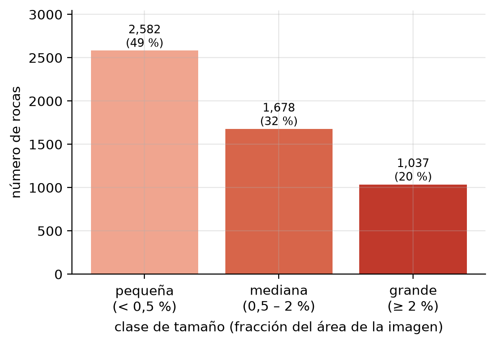

El resultado es una **distribución decreciente**: predominan las rocas pequeñas y la
frecuencia disminuye al aumentar el tamaño. Esta forma coincide cualitativamente con las
distribuciones tamaño–frecuencia descritas en los estudios de abundancia de rocas en
sitios de aterrizaje, aunque aquí los tamaños son relativos al campo de visión y no
métricos, por lo que la comparación es de forma y no de magnitud.

La roca de mayor tamaño registrada ocupa el 86,1 % del área etiquetada de su escena. La
solidez media de las regiones aceptadas es de 0,926, es decir, formas compactas; solo 20
imágenes presentan solidez media inferior a 0,7, señal de contornos cóncavos o de
regiones posiblemente subdivididas en exceso.

## 4. Composición del terreno y tipología de escenas (E3)

Además de los dos indicadores previstos, cada imagen se caracterizó por la proporción de
cada clase sobre sus píxeles etiquetados. La composición media es: **lecho rocoso 49,8 %,
suelo 36,4 %, arena 12,5 % y roca grande 1,3 %**. La clase dominante es el lecho rocoso en
8 234 imágenes, el suelo en 5 767, la arena en 1 792 y la roca grande en apenas 108.

A partir de esa composición se definió una tipología de escenas (Figura 17):

| Tipo de escena | Criterio | Imágenes | % |
|---|---|---:|---:|
| Rocoso | roca ≥ 66 % | 7 601 | 47,3 |
| Suelo | suelo ≥ 50 % | 5 723 | 35,6 |
| Arenoso | arena ≥ 50 % | 1 742 | 10,8 |
| Mixto | ninguna clase predomina | 835 | 5,2 |

> **Figura 17.** Tipología de escenas según la composición del terreno.
>

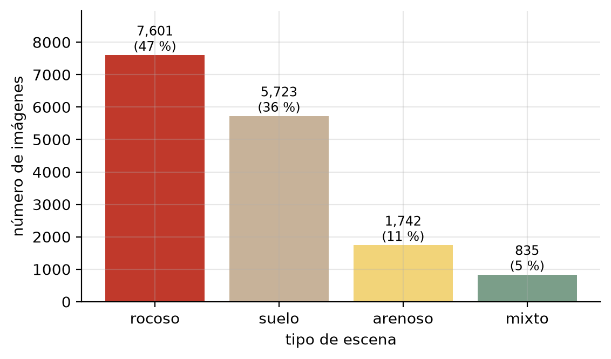

Un resultado relevante para la interpretación conjunta es que la cobertura y el conteo son
**indicadores prácticamente independientes**: entre las imágenes aptas, su correlación es
de **r = 0,03**. Una escena puede estar casi totalmente cubierta por lecho rocoso continuo
y no contener ninguna roca contable, o presentar poca cobertura y varios bloques
aislados. Los dos indicadores describen, por tanto, aspectos distintos del terreno y no
son redundantes.

## 5. Variación a lo largo del recorrido (E3)

Ordenando las imágenes por el reloj de nave incluido en su identificador —que crece
monótonamente con el tiempo y sirve como proxy del avance del recorrido— y agrupándolas
en tramos de igual número de imágenes, se observa (Figura 18) una **alternancia clara
entre tramos francamente rocosos y tramos de suelo o arena**, con concentraciones
puntuales de roca grande que alcanzan hasta el 40 % de las imágenes de un tramo.

> **Figura 18.** Cobertura y presencia de roca grande a lo largo del recorrido.
>

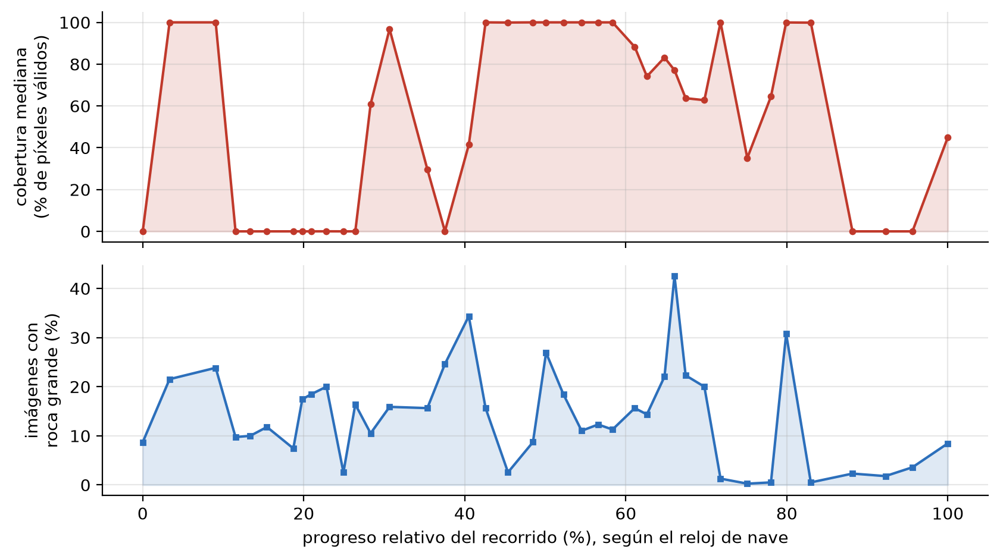

Esta lectura responde de forma directa a la pregunta planteada en la introducción sobre en
qué tramos del trayecto se concentra la roca visible. Debe interpretarse como una
ordenación relativa y no como una serie temporal calibrada, pues el eje refleje el orden
de adquisición y no el sol ni la distancia recorrida.

Cabe señalar que el subconjunto es casi enteramente de la cámara izquierda del par
estéreo (16 027 imágenes frente a 37 de la derecha), por lo que no fue posible una
comparación entre ojos.

## 6. Validación con etiquetas de experto

El dataset incluye 322 máscaras etiquetadas por especialistas con acuerdo del 100 %. Se
ejecutó sobre ellas el mismo procedimiento, sin modificar parámetros, y se comparó con las
máscaras colaborativas empleadas en el análisis principal (Figura 19):

| Indicador | Colaborativas | Experto |
|---|:---:|:---:|
| Cobertura mediana | 96,8 % | **46,1 %** |
| Imágenes con cobertura del 100 % | 42 % | **8 %** |
| Píxeles de lecho rocoso | 49 % | 31 % |
| Píxeles de suelo + arena | 50 % | **69 %** |
| Imágenes con roca grande | 13,7 % | 16,5 % |

> **Figura 19.** Comparación de la cobertura entre etiquetas colaborativas y de experto.
>

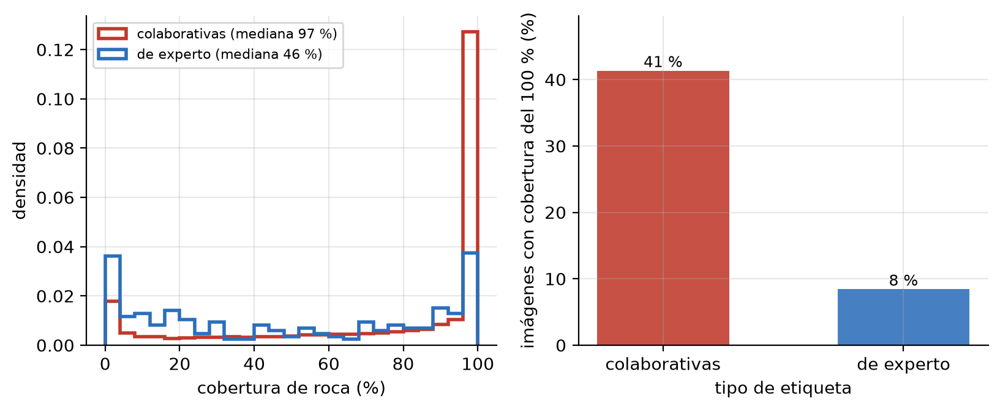

La discrepancia es sistemática y de gran magnitud en la cobertura, mientras que la
presencia de roca grande y el conteo resultan comparables (mediana de 2 rocas frente a 1).
La sección de discusión analiza esta diferencia.

## 7. Comparación con métodos de aprendizaje automático

Como exploración complementaria se contrastó el procedimiento con dos enfoques de
aprendizaje automático, ejecutados en equipo local.

**Modelo general sin entrenamiento específico.** Un modelo fundacional de segmentación
(Segment Anything, variante FastSAM) se aplicó a 50 imágenes con roca grande,
restringiendo sus regiones a la zona etiquetada como roca. El acuerdo con el conteo
clásico, medido por bandas, es del **44 %**, con correlación de rangos de 0,57 y un error
absoluto medio de 2,7 rocas (Figura 20). El modelo tiende a subdividir una misma roca
según su textura interna y, en otras escenas, a no detectar bloques de bajo contraste.

> **Figura 20.** Matriz de acuerdo entre el conteo clásico y el modelo general.
>

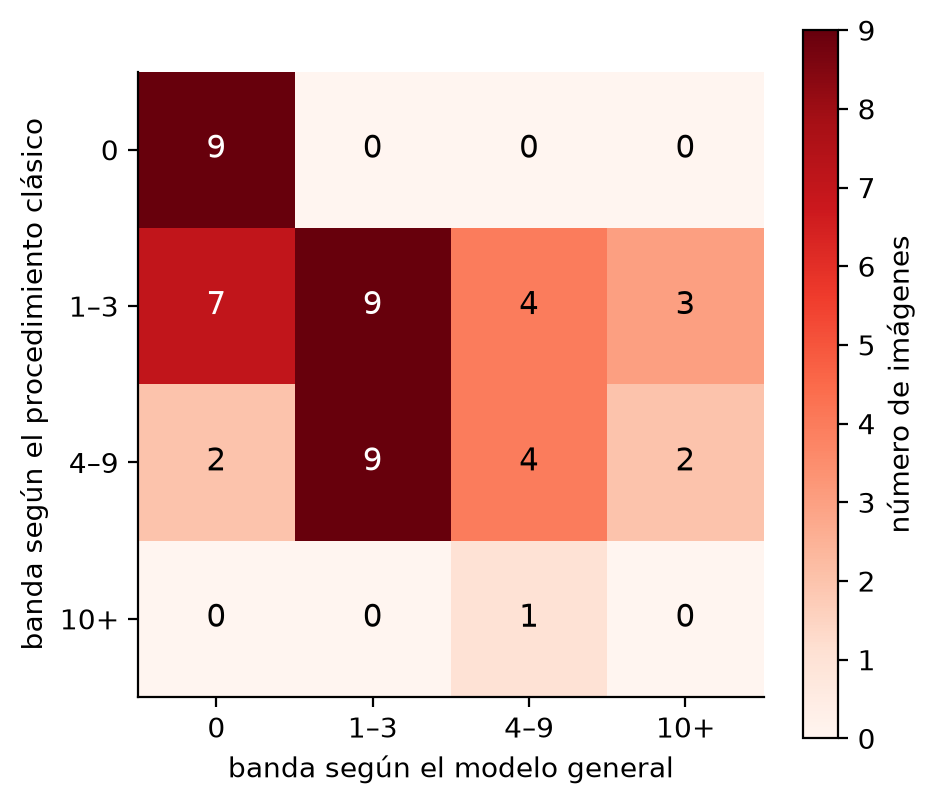

**Modelo entrenado con las propias máscaras.** Se entrenó un segmentador DeepLabV3 por
aprendizaje por transferencia para distinguir roca de no-roca, usando las máscaras de
AI4Mars como etiquetas y reservando conjuntos de validación y prueba. A partir de la
máscara predicha se recalculó la cobertura y se comparó con la derivada de la máscara
humana (Figura 21). Los resultados se reportan en el Cuadro 3.

> **Figura 21.** Cobertura estimada por el modelo frente a la derivada de la anotación humana.
> *(figura pendiente: se genera al terminar el entrenamiento)*

> **Cuadro 3.** *(Pendiente de completar con la ejecución en configuración ampliada; la
> prueba preliminar reducida arrojó IoU medio de 0,79, IoU de la clase roca de 0,73 y una
> correlación de 0,84 entre la cobertura predicha y la humana, con error absoluto medio de
> 9,9 puntos porcentuales.)*

---

# Capítulo: Discusión y limitaciones

## 8. Interpretación de los indicadores

El trabajo confirma que las máscaras de AI4Mars pueden leerse como mapas cuantitativos y
no solo como insumo de entrenamiento. Los dos indicadores propuestos se obtuvieron para la
totalidad del subconjunto y resultaron interpretables sin conocer los detalles del
procedimiento: una cobertura del 90 % describe una escena dominada por roca, y un conteo
de ocho bloques describe un terreno con obstáculos discretos.

El hallazgo de que ambos indicadores son **estadísticamente independientes** (r = 0,03)
refuerza la decisión de reportarlos por separado. La cobertura mide *cuánta* roca hay; el
conteo mide *cómo está organizada*. Un afloramiento continuo produce cobertura máxima y
conteo nulo; un campo de bloques dispersos produce lo contrario. Para aplicaciones de
transitabilidad ambas facetas importan, y ninguna sustituye a la otra.

## 9. El sesgo de la anotación colaborativa

El resultado más relevante de la validación es que la cobertura calculada sobre las
máscaras colaborativas **sobreestima sistemáticamente** la proporción de roca: la mediana
pasa de 96,8 % a 46,1 % cuando se emplean máscaras de experto, y la proporción de imágenes
con cobertura total cae del 42 % al 8 %.

La explicación más plausible es un sesgo de saliencia en la tarea de anotación: la roca es
visualmente prominente y fácil de delimitar, mientras que el suelo y la arena son
superficies extensas y homogéneas cuya delimitación resulta tediosa y menos evidente. Al
requerir acuerdo entre anotadores, los píxeles de suelo y arena sin consenso quedan como
"sin etiqueta" y desaparecen del denominador, lo que eleva la fracción de roca. La
composición confirma este mecanismo: los expertos etiquetan un 69 % de píxeles de suelo y
arena frente al 50 % de las máscaras colaborativas.

Es importante precisar el alcance de esta limitación. El procedimiento de cálculo no está
sesgado: aplicado a las máscaras de experto entrega valores plausibles. El sesgo reside en
los datos de entrada. En consecuencia, **las coberturas reportadas deben leerse como
relativas al conjunto colaborativo** y no como estimaciones absolutas de la abundancia de
roca en el terreno. Para comparaciones entre escenas del mismo conjunto —el uso previsto
de los indicadores— el sesgo es en buena medida común y no invalida el ordenamiento; para
cifras absolutas, la referencia adecuada es el subconjunto de experto.

Que la correlación entre cobertura y fracción etiquetada sea nula (r = −0,02) permite
descartar una explicación alternativa: el problema no es *cuánto* se etiquetó, sino *qué
clases* se etiquetaron.

## 10. Sobresegmentación de afloramientos continuos

La limitación anticipada en la metodología se confirmó. Cuando una región etiquetada como
roca grande es extensa y continua —un afloramiento antes que un bloque suelto—, la
transformada de distancia presenta varias crestas y la división de aguas la subdivide,
aunque geológicamente corresponda a una sola unidad (Figura 22).

> **Figura 22.** Caso de subdivisión en una escena con regiones alargadas y cóncavas.
>

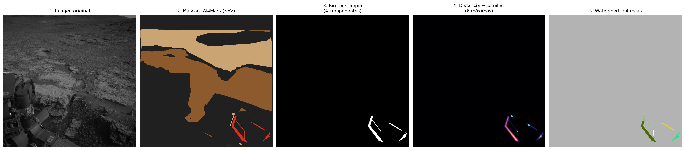

La calibración de los parámetros permitió acotar el efecto sin eliminarlo. El ajuste
adoptado (separación mínima entre máximos de 15 píxeles y suavizado de la transformada de
distancia de 3,0) redujo notablemente los máximos espurios: en una escena de prueba, los
máximos detectados pasaron de más de un centenar a un número acorde con las rocas
visibles. Endurecer más los parámetros reduce la subdivisión de afloramientos, pero
entonces subestima el conteo en escenas con cúmulos de rocas realmente distintas. Se trata
de un compromiso inherente al método, no de un defecto de implementación, y se resolvió
privilegiando la fidelidad en las escenas con bloques separados, que son las que el
indicador pretende describir.

La magnitud del problema es acotada: solo nueve imágenes superan las quince rocas
contadas, y únicamente veinte presentan solidez media inferior a 0,7. La solidez, incluida
en la tabla de resultados, permite señalar automáticamente los casos sospechosos sin
inspección visual, lo que constituye un aporte práctico del trabajo.

## 11. La escasez de la clase "roca grande"

La clase roca grande resultó considerablemente menos frecuente de lo previsto: aparece en
el 13,9 % de las máscaras y representa en promedio el 1,3 % de los píxeles etiquetados.
Esto tiene dos consecuencias.

La primera es de alcance: el conteo se aplica a unas 2 200 imágenes en lugar de a las
16 000 del conjunto, y de ellas 421 quedan en cero tras los filtros. El indicador de
conteo es por tanto sólido pero de cobertura limitada, y el trabajo lo reporta como
análisis sobre las escenas que contienen roca grande, reservando la cobertura como
indicador principal.

La segunda es metodológica y afecta a las líneas futuras: cualquier modelo que intente
predecir la clase roca grande enfrentará un desbalance extremo. Esta consideración motivó
que la exploración de aprendizaje automático se plantease en términos binarios
—roca frente a no-roca—, mucho más equilibrados.

## 12. Sobre los métodos de aprendizaje automático

Los dos enfoques explorados arrojan una conclusión matizada.

El modelo general sin entrenamiento específico **no reproduce** el conteo clásico: coincide
en la banda de conteo en el 44 % de los casos. La razón no es un fallo del modelo sino una
diferencia de definición. El modelo segmenta por apariencia visual y delimita regiones
homogéneas de textura; el procedimiento clásico cuenta bloques dentro de una anotación
semántica. Ante una roca con vetas o sombras marcadas, el primero identifica varias
regiones y el segundo una sola. Ambos son coherentes con su propia definición de objeto,
pero no son intercambiables. Este resultado justifica que un modelo de propósito general
no baste para el dominio marciano y que se requiera ajuste específico.

El modelo entrenado con las propias máscaras sí resulta prometedor para la cobertura: a
partir únicamente de la imagen alcanza una correlación alta con el indicador derivado de
la anotación humana. Esto respalda empíricamente la posibilidad, planteada en el
planteamiento del problema, de emplear los indicadores obtenidos como referencia para
entrenar modelos que los predigan. Conviene subrayar que el modelo aprende a reproducir
las anotaciones colaborativas, con su sesgo incluido; reproduce el indicador, no la verdad
del terreno.

## 13. Limitaciones del estudio

1. **Sesgo de la anotación de entrada**, discutido en la sección 9: las coberturas son
   relativas al conjunto colaborativo.
2. **Alcance del conteo**, limitado a las escenas con roca grande (sección 11).
3. **Subdivisión de afloramientos continuos**, acotada pero no eliminada (sección 10).
4. **Medidas relativas al campo de visión.** Todos los tamaños se expresan como fracción
   del área de la imagen. Sin información de rango o de calibración geométrica no es
   posible convertirlos a magnitudes métricas, de modo que las comparaciones son válidas
   entre imágenes de la misma cámara pero no con inventarios métricos de la literatura.
5. **Corte transversal.** Cada imagen se trata de forma independiente; la lectura del
   recorrido es una ordenación relativa y no una serie temporal calibrada.
6. **Alcance del subconjunto.** Solo MSL NavCam con etiquetas de entrenamiento; los
   resultados no se extrapolan a otras misiones ni cámaras sin repetir el análisis.
7. **Validación humana pendiente.** El contraste con conteos manuales por bandas queda
   como tarea de cierre.

## 14. Líneas futuras

- **Corrección del sesgo de anotación**, aprovechando el subconjunto de experto para
  estimar un factor de ajuste o para reentrenar sobre etiquetas más completas.
- **Regla de fusión posterior** al *watershed*, basada en solidez o compacidad, que
  reintegre las subdivisiones de afloramientos continuos.
- **Extensión del enfoque aprendido al conteo**, alimentando las máscaras predichas al
  procedimiento de división de aguas para cerrar también el segundo indicador.
- **Conversión a magnitudes métricas** incorporando los productos de rango del dataset,
  lo que permitiría comparar los resultados con inventarios de abundancia de rocas.
- **Aplicación a otras misiones y cámaras**, en particular al conjunto de Perseverance,
  donde la roca grande es notablemente más frecuente.
